# HIV Case Surveillance System Design { #hiv-cs-design }

## Background and Purpose

The HIV Case Surveillance system is designed to support implementation of the [WHO’s consolidated guidelines on person-centered HIV patient monitoring and case surveillance (2017)](http://www.who.int/hiv/pub/guidelines/person-centred-hiv-monitoring-guidelines/en/) and the updated 2020 [Consolidated HIV Strategic Information Guidelines: Driving Impact Through Programme Monitoring and Managemen](https://apps.who.int/iris/handle/10665/331697)t, as well as the not yet published Digital Accelerator Kit for HIV.

HIV Case Surveillance is related to, yet distinct from, patient monitoring; it refers to the “reporting of an initial diagnosis of HIV infection and defined sentinel events from every person diagnosed with HIV to a public health agency responsible for monitoring and controlling the epidemic. Key sentinel events include HIV diagnosis, entry into care, initiation of ART, viral suppression and death. Information from each case is linked over time and stored as individual-level data in a database at subnational and/or national levels. HIV case surveillance is referred to in some countries as case notification or case reporting, particularly when limited to reporting of new HIV diagnoses without longitudinal data capture. The ability to link notifications or reports of sentinel events to a case over time and maintain data in disaggregated form at the individual level are the distinguishing features of HIV case surveillance systems.”

The basic principles of operation are based on the [WHO’s Consolidated Guidelines on Person-Centred HIV Surveillance](https://www.who.int/hiv/pub/guidelines/person-centred-hiv-monitoring-guidelines/en/) and respective annexes, whilst at the same time being informed by the yet to be published [Digital Accelerator Kit for HIV.](https://www.who.int/reproductivehealth/publications/digital-accelerator-kits/en/)

## System Design Overview

### Use Case

The requirements for tracking an individual case over time and linking key sentinel events to that case necessitates the use of unique identification standards, possibly composed of one or more unique identifiers, and/or patient identifying information. The Tracker data model in DHIS2 is used to meet these requirements. This program is designed to capture the minimum data elements necessary to produce the required indicators identified by[the consolidated guidelines for person-centered HIV monitoring](https://www.who.int/hiv/pub/guidelines/person-centred-hiv-monitoring-guidelines/en/). \
The program includes some basic level of decision support and prompts to aid those countries which will be using it within a clinical setting, thereby adding the need for extra data inputs. Whilst the primary purpose of this configuration is for programme management, it can be modified to be used as a clinical care tool.

### Workflow

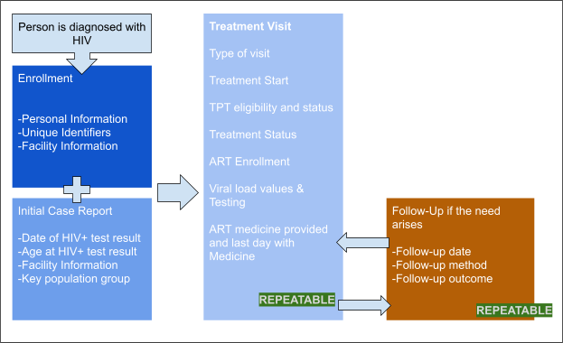

### Programme Structure

| Stage | Description |
|---|---|
| Enrollment  | Once a patient is identified as HIV positive they should be enrolled in the HIV Case Surveillance Programme. The enrollment stage includes personal information and unique identifiers, some of which will be auto generated. All patients enrolled in this registry are HIV positive, and therefore it is important that access is limited to those who need it, this requires adapting to local patient privacy policies and local needs.Identifying information (Patient profile) is available as a widget in the tracker capture data entry screen. |
| Initial Case Report | The initial case report can be filled at the same time as the enrollment of the patient.This stage contains the baseline for the rest of the treatment, including date of HIV diagnosis and age at diagnosis. If the patient belongs to a key population group, it can be selected here.  This is a non-repeatable stage as the initiation details are only collected once for each case that is registered. |
| Treatment Visit | The Visit stage is the stage where all the treatment components are recorded.Once the reason for the visit is recorded, the first check is the reason for the visit and whether or not the PLHIV has begun their treatment and when. The rest of the data elements are hidden until the treatment has started.The second check is whether the PLHIV is eligible for Tuberculosis preventive therapy. If they are, a section on TPT is unhidden, where the treatment start, type and completion can be recorded. Finally there is a treatment status check, where PLHIV can be categorised as Retained on ART, having stopped their treatment, transferred or died.If the treatment status is retained on ART, it reveals the option to add how many days of ART is provided and it automatically calculates when is their last day with ART.If the patient has been on ART for more than 180 days, the fields for viral load testing information appear, including the test date, viral load status and if available, the previous viral load value. This is a repeatable stage, as it will be conducted continuously over the lifespan of the case re-visiting the clinic to pick up medicine, perform checkups,and routine (and/or targeted) viral load testing, based on WHO and national clinical guidelines. |
| Follow-Up | This Stage is not tied to any indicators and is purely designed as a tool for recording any contact made with patients who have missed treatment visits, and will need to be contacted. This is a repeatable stage, to allow for multiple follow-ups. |

## Tracker Configuration

### Tracked Entity Instance

The program uses the Tracked Entity Instance type “Person”. The TEI will be enrolled for their lifetime in this tracker and they will be enrolled after they have been diagnosed with HIV. This presumes that there is a separate registry for HIV tests outside of this program.

### Stages

#### Enrollment & Initial Case Stages

The initial case stage is included with the enrollment stage to facilitate data entry. Note that sections and some of the program rule actions are not supported when the stage is included in the enrollment screen, and therefore some of the form behaviour might not be as expected.

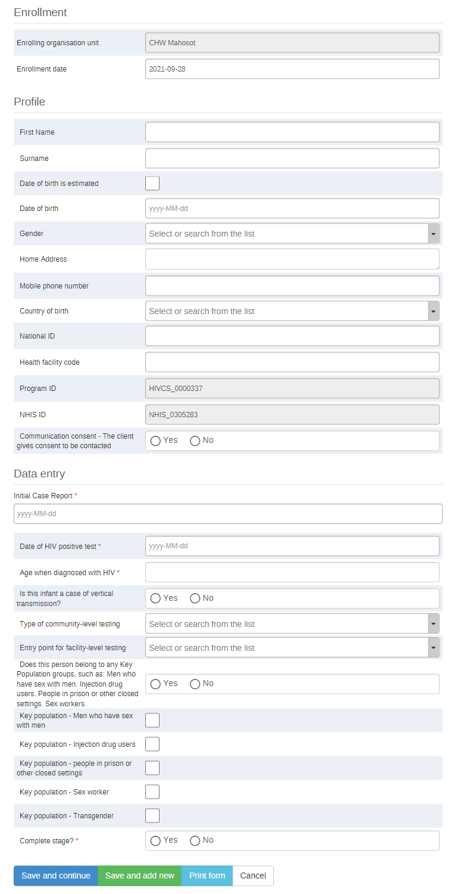

##### Enrollment

The enrollment stage gathers all the attributes of a person registered. A country should modify the enrollment to ensure that it matches their needs and practices.

| Attribute name | Value |
|---|---|
| Enrolling organisation unit | Organisation unit |
| Enrollment date | Date |
| Given Name | text |
| Family Name | text |
| Date of Birth is Estimated | yes only |
| Date of Birth  | date  |
| Gender | OptionSet: Male/Female/Transgender/Other |
| Address (current) | text |
| Mobile phone number | phone number |
| Country of Birth | Country list |
| National ID | number/text |
| Health Facility Code | text |
| Program ID | System Generated |
| NHIS ID | System Generated |
| Communication consent - the client gives consent to be contacted | Yes/No |

###### Identifiers

Currently, the programme has four unique identifiers in addition to personally identifying information in order to minimise duplication. If the identifiers are all done within the same instance of DHIS2, they can all be validated as unique. Modifying the identifiers is likely to be one of the first changes needed to adapt the package to the local context.

National ID : A unique identifier usually provided by a national CRVS office.

Health facility code: A local patient identifier which may be derived from existing paper records.

Program ID: A Unique identifier within the HIV programme. This is sometimes referred to as the ART number or Patient number. If it does not exist on enrollment, it can later be added.

NHIS ID: An identifier for the patient within the NHIS and independent of the case surveillance programme.

DHIS2 can be programmed to assign unique identifiers automatically based on a rule-set and general expression, or allow for manual input of unique and non-unique identifiers depending on country needs and capabilities.  

If you will be using android devices, there are some issues if the system-assigned pattern is sequential or date-based. More information here: [https://docs.dhis2.org/](https://docs.dhis2.org/en/implement/android-implementation/dhis2-configuration-for-android.html#implementation_guide_dhis2_config_reserved_id)  

##### Initial Case

The initial case stage is annexed to the enrollment stage for data entering purposes.
This stage records the basic information about the patient's HIV diagnosis that is not likely to change. (If there is a change to KP status, for example the patient is no longer incarcerated, this can later be updated in the case report if necessary).

| Name | Value |
|---|---|
| Initial case report | date |
| Date of HIV positive test | date |
| Type of community-level testing | Option set: Type of community-level testing: Mobile testing (e.g. through vans or temporary testing facilities); Voluntary Counselling and Testing centres (not within a health facility setting); Other community based testing |
| Entry point for facility level testing | Option SetEntry point for facility-level testing: Mobile testing (e.g. through vans or temporary testing facilities); Voluntary Counselling and Testing centres (not within a health facility setting); Other community based testing |
| Age when diagnosed with HIV | Calculated age (Integer) |
| Is this infant a case of vertical transmission? | Yes/no, Only visible if case is under 2 years old. |
| Does this person belong to any Key Population groups, such as: Men who have sex with men. Injection drug users. People in prison or other closed settings. Sex workers. | Yes/No |
| Key population -  Men who have sex with men | Yes only |
| Key population - Injection drug users | Yes only |
| Key population - people in prison or other closed settings | Yes only |
| Key population - Sex worker | Yes only |
| Key population - Transgender | Yes only |

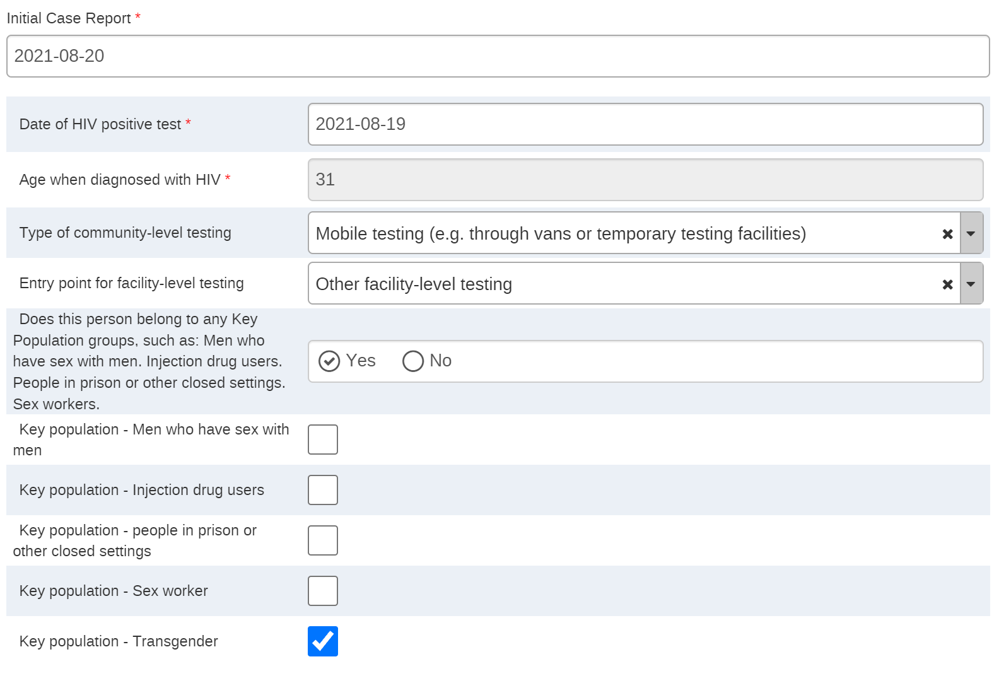

If a patient’s gender is marked as “transgender”, a warning shows up prompting the user to mark their key population status as “transgender”.

#### Treatment Visit

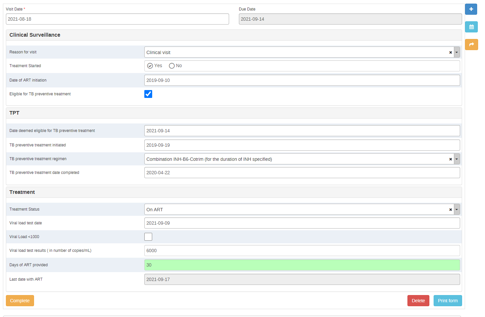

| Name | Value | Comment/Logic |
|---|---|---|
| Visit Date | Date | Event date feature |
| Due date | Date | Due date for event |
| Reason for visit | Option set "Reason for visit": Clinical Visit; Antiretroviral drug pick-up; Issues and concerns |  |
| Treatment started | Yes/No | Hides treatment section when "Yes" is not selected, value "Yes" is transferred to new events. |
| Date of treatment initiation | Date | This is a date element used to calculate when the initiation takes place. Once entered the first time, the date value entered will transfer to future visits |
| The patient is eligible for TB Preventive treatment | Yes only | If this is not checked, TPT elements are hidden |
| Date deemed eligible for TB preventive treatment | Date | Fill only once, perdures through subsequent visits |
| TB preventive treatment initiated | Date | Fill only once, perdures through subsequent visits |
| TB preventive treatment regimen | Option Set: TBT Regimen | Fill only once, perdures through subsequent visits; See yellow tab "Option Sets" |
| TB preventive treatment date completed | Date | Fill only once, perdures through subsequent visits |
| Restart TB preventive treatment | Yes only | Once checked, it makes the other fields editable. Appears only after the TB preventive treatment is completed. |
| Treatment Status | Option Set: patient Status | If status is not "retained on ART" the rest of the stage is hidden |
| Currently pregnant | Yes only | Appears only if client is "on treatment" and is a woman. |
| Date of Death | date | Appears only if option "Death" is selected |
| Date client status changed | date | Appears only if options "Reused treatment", "Transferred out" or "Lost to follow up" are selected |
| HIV viral load test date | date | Only visible if days between treatment start and event >180 |
| Viral Load <1000 | checkmark (Yes only) | Only visible if days between treatment start and event >180 |
| HIV viral load test result | Number | Only visible if days between treatment start and event >180, and if "Viral load <1000" is not checked |
| Previous Viral load value | Number | Only visible if days between treatment start and event >180. Displays the viral load value from the previous visit automatically, if there was a previous visit. |
| Days of ART provided | Number |  |
| Last date with ART | Displays the last date where the patient has medicine | Automatically calculated based on "Visit date" + "Days of ART provided" |

The Treatment visit stage is divided into three sections.

Clinical Surveillance:

The clinical surveillance section starts by asking whether or not the PLHIV has started antiretroviral treatment (ART). If the patient has started their treatment, the treatment section appears. Likewise, if the “the patient is eligible for TB preventive therapy” field is marked, this section appears. Otherwise, both sections will remain hidden. If the treatment is initiated after 14 days, a late initiation message will appear in the top bar.

TPT:
The TPT section records the date when the person was deemed eligible for TB preventive treatment (based on initial and/or follow-up TB symptom screening), the date when it was initiated and regimen, and the date of completion. Once values are entered here, they will perdure in following stages and no additional data entry is needed.

Once a patient has completed their treatment, the field “Restart TPT” will show up. Checking this box will allow you to delete the existing values and start a new round of TPT.

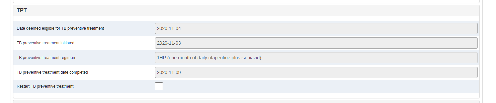

Treatment:

The first Data Element in the treatment section asks to select the status of the treatment. If a patient is marked as “Retained on ART” the rest of the fields appear. If a patient is marked as dead, stopped treatment, officially transferred out, or lost to follow up, the rest of the fields remain hidden.

If the patient has been in ART for less than 180 days (6 months), a message reads “Viral load fields are only available to patients who have been on ART for six months or more.”  Once a patient has been on ART for 180 days or more (From treatment start date to current date), the fields to register viral load testing and status appear.

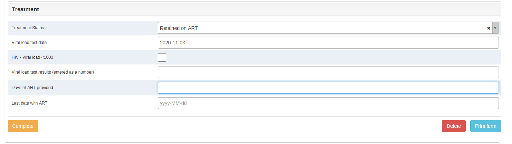

The viral load fields include a checkbox for when the PLHIV enters viral suppression: less than 1000 copies/ml, which is based on the current WHO guidelines, but this should be adapted according to national clinical guidelines.

If if the viral load is less than 1000 copies/ml, the field “Viral load test results (entered as a number)”  is hidden and the top bar displays the legend “this person is virally suppressed”

At the end of the section inputting the days of ART provided will calculate the last date with ART, which is an aid to schedule the next appointment.

### Follow Up

| Name | Value | Comment |
|---|---|---|
| Date of attempt to contact client | date | Feature |
| Reason for follow up | Reason for follow up: Missed clinical care visit Missed medication pickup Missed non-clinical care visit Did not initiate ART Inconclusive HIV status Test results received Other follow up reason (specify) |  |
| HIV Follow-up Method | Option set Follow up Methods: Text Message Phone Home visit Other |  |
| HIV Follow-up Outcome | Option set Follow up outcomes: Returning to clinic Self transferred out Hospitalized Refused to return Not located Died (reported) Confirmed dead | If one selects Died (reported); Died (confirmed), Not located, or Refused to return, then warning appears: "If a patient changed status (died, moved, decided to stop treatment, has been out of treatment for more than 28 days, etc.) you must complete a visit stage and record this change in status." |
| HIV Follow-up Notes | Long Text |  |

The follow up stage is designed to be useful when a patient has not attended  their latest appointment, but is still under treatment. It is not currently linked to indicators and can safely be removed from the programme if not used in a clinical setting without affecting the other modules.

It records the reason why this follow up is needed (Missed clinical care visit, missed medication pickup, missed non-clinical visit, did not initiate ART, inconclusive HIV status, test results received, Other follow up reason) follow-up method (Text message, phone call, home visit or other) and the result of the follow up (Returning to clinic, self-transferred out, hospitalized, refused to return, not located, reported dead, confirmed dead). If when following-up the patient has changed their treatment status (for example, decided to stop treatment), the program displays a prompt to complete a Visit stage option and record this.

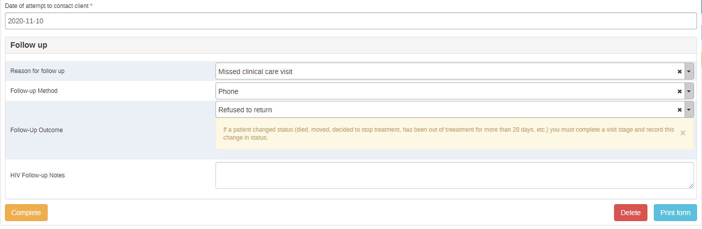

### Data Entry Screen Set-up

An initial setup is necessary to optimally configure the patient data entry screen.

By clicking on the cog icon on the top right hand side you can access the widget menu and organise the data entry dashboard to match local workflows by hiding or showing widgets.

 We recommend that the programme is used with “tabular data entry” instead of “Timeline data entry”, and that it includes at least the enrollment, feedback, indicators, profile and report widgets, as well as the top bar. System administrators can lock the layout for all other users.

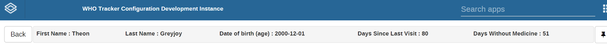

The top information bar can be used to highlight relevant information. In this picture, it shows the name, date of birth, the number of days since the last visit (in case it has exceeded 28 days) and the number of days without medicine if relevant. This bar can be modified and configured according to the user's need to display other information. For information on how to configure the top bar see the documentation: [https://docs.dhis2.org/en/use/user-guides/dhis-core-version-236/tracking-individual-level-data/tracker-capture.html#top-bar](https://docs.dhis2.org/en/use/user-guides/dhis-core-version-236/tracking-individual-level-data/tracker-capture.html#top-bar)

### Security and Access

For general security considerations about your DHIS2 instance, please see [https://dhis2.org/security/](https://dhis2.org/security/)

#### Search Settings

The programme is currently set to “Open” which means that, as long as users are allowed to search in other org units by the [user search settings](https://docs.dhis2.org/en/implement/understanding-dhis2-implementation/users-and-user-roles.html) which have been assigned to the them, they will be able to search and access patients in other organisation units.  

A more secure option would be to set up the programme as **protected**. This means that a user may read and write to tracked entity instances that are owned by the organisation unit(s) to which the user is assigned data capture access, but their search scope should be wider than their read/write scope in order to ensure that they will identify any existing patients during a search, even if they do not belong to their facility. If the search returns a patient that exists outside of their facility, the user is presented with the option to access the patient record by first recording a reason for accessing the record. This approach to privacy is known as ‘breaking the glass’, as it allows the user to make the decision to access the record without outside permission or assistance, but leaves a clear trail to be audited. Once the user gives a reason for breaking the glass, they gain temporary ownership of the tracked entity instance (see the [Tracker User Guide](https://docs.dhis2.org/2.34/en/dhis2_user_manual_en/using-the-tracker-capture-app.html#breaking-the-glass) for more information.)

Note that for android-based implementations, if you want users to be able to search clients in a different org unit than their own, the search settings MUST be set to “open” as the other search features are not fully supported. More information available here: [https://docs.dhis2.org/en/full/implement/dhis2-android-configuration-guide.html](https://docs.dhis2.org/en/full/implement/dhis2-android-configuration-guide.html)

#### User Management

There are three user groups currently included in the package.

**HIV Case Surveillance - Data Analysis**: Has access to dashboards but cannot modify metadata or enter new data

**HIV - Case Surveillance - Data Entry**: Can enter data and create new patient records

**HIV Case Surveillance - Metadata Admin**: Can modify the metadata

The country implementing it should ensure that users have data entry rights for their respective Organisation units, and search rights for all organisation units which will be providing HIV services to facilitate movement between clinics.

#### Referrals and Ownership

Within Tracker, the organisational unit is both the enrolling org unit and has ownership of the case. The ownership of the case can be transferred between organization units using the "move permanently" functionality, or simply referred for services, using the "one time referral" function. The program can also be configured to allow for many/all org units to have access to provide services (or "register events") even without transferring ownership.
To do this, one needs to first click on the “make referral” button

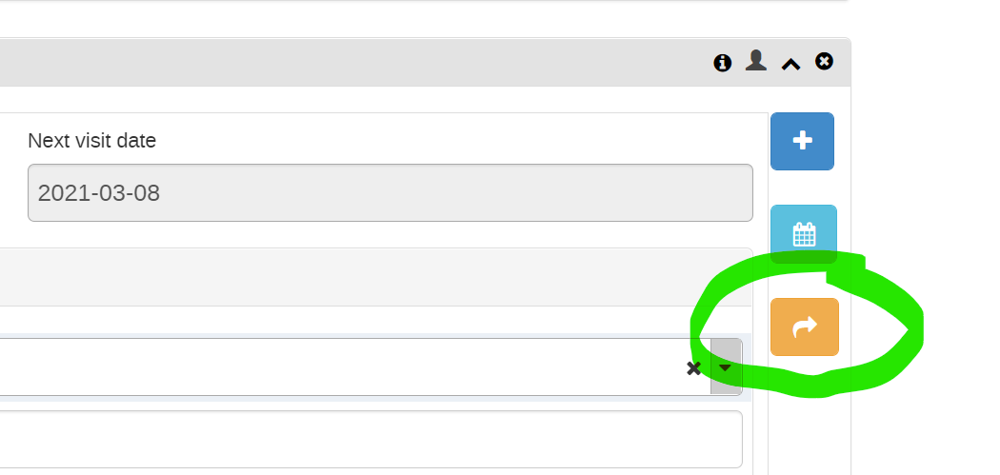

This will open the referral window, which will allow for a one time referral or a permanent transfer:

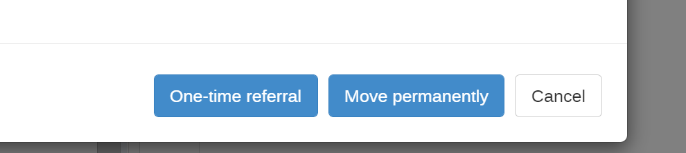

### Program Rules

The programme includes several logic rules to facilitate data entry and workflow and calculations, as well as display useful information.

| name | id | description | priority | condition |
|---|---|---|---|---|
| Calculate Age at HIV+ Test | NkKReOZIHIX | This rule calculate the years (integer) between the date of birth, and the date of HIV diagnosis, and assigns the value to the DE "Age at Diagnosis" | 1 | d2:hasValue( 'HIV_TEST_DATE' ) |
| Days Without Medicine | GxoeUZf5aWb | This rule is made to display when a patient has been without medicine for more than 28 days, and it shows us how many days without medicine. |  | d2:daysBetween( #{Last Day With Medicine}, V{current_date} )  > 28  && d2:hasValue( 'Last Day With Medicine') |
| Display date of treatment initiation | xiMJ5cEgJfN | THis is so that we have a constant date for when the treatment was initiated and we can calculate indicators. |  | d2:hasValue( 'Date of Initiation previous' ) |
| Display date they became eligible for TPT | xRECtYcrv6u | Displays the date a patient became eligible for TPT from the first time they became eligible. |  | d2:hasValue( 'Previously TPT eligible' )  && !#{TPT_Restart_Treatment} |
| Display Error if Test Date Before Birth | gZy3eQsP9Lx | The HIV test cannot be before the patient was born |  | d2:hasValue( 'HIV_TEST_DATE' )  && (#{HIV_TEST_DATE} < A{AGE})  |
| Display if previously eligible for TPT | MvAYneJFL2Q | Displays if previously eligible for TPT | 1 | d2:hasValue( 'Previously TPT eligible' )  && !#{TPT_Restart_Treatment} |
| Display Latest HIV Viral Load | xr4PnRTTFjr | This rule displays the latest viral load for a patient when they are not in viral suppression.  |  | d2:hasValue( 'HIV Viral Load Latest' )  |
| Display TPT date completed if completed | DICAiThz6Px | Displays the date a treatment was completed it if was previously completed. |  | d2:hasValue( 'TPT Date previously Completed' )  && !#{TPT_Restart_Treatment} |
| Display TPT date initiated if initiated | O9TJOZkACxU | Displays the date a treatment was initiated it if was previously initiated |  | d2:hasValue( 'TPT Date Initiated Previous' )  && !#{TPT_Restart_Treatment} |
| Display TPT Regimen previously adopted | rhdEpzJFAFn | Displays the TPT regimen the patient is following |  | d2:hasValue( 'TPT Regimen From previous' )  && !#{TPT_Restart_Treatment} |
| Display warning "If a person changed patient status, you must record it in the visit stage) | aE5Uc6sW8dL | This rule for the follow up stage displays a warning if there is a change in status, asking for this to be registered in the visit stage |  | #{Follow-up_Result}  == 'REFUSED_TO_RETURN'  \|\| #{Follow-up_Result}  == 'REFUSED_TO_RETURN' \|\| #{Follow-up_Result}  == 'DIED_REPORTED' \|\| #{Follow-up_Result}  == 'DIED_CONFIRMED' \|\|  #{Follow-up_Result}  == 'NORESPONSE' |
| Error if no keypop selected | uvE3pz9mye4 | If the person is marked as belonging to a key population group, then at least one key pop groups should be checked. |  | #{KEY_POPULATIONS_YN} == true  && (!#{Keypop_drug} && !#{Keypop_MSM} && !#{Keypop_prisoner} && !#{Keypop_sex_worker} && !#{Keypop_trans}) |
| Hide date of death if not dead | zDB2AmOWyEW | If patient is not dead, it hides the date of death DE. |  | #{Patient Status} != 'DEAD' |
| Hide Date of treatment change if retained or dead | CXMkCYwEzEw | Hide Date of treatment change if retained or dead |  | #{Patient Status} != 'TREATMENTSTOPPED' && #{Patient Status} != 'TRANSFEROUT' && #{Patient Status} != 'LTFU' |
| Hide if not TPT eligible | hCvSfbSiOUR | If the patient is not eligible for TPT, it hides the TPT section | 2 | !d2:hasValue('Eligible for TPT') |
| Hide key population options if not member | rGcmQkBMjXF | If the patient is not marked as being a member of a key population, hide the DEs to select the key population.  |  | !#{KEY_POPULATIONS_YN} |
| Hide pregnant if male | vV7Isi7RnLl | If patient is male, hide pregnant |  | A{Gender} != 'FEMALE' |
| Hide Previous viral load value if Previous viral load results are empty | amEUbPOt1T3 | If the field "viral load" didn't have any value in the previous event, it hides the field "previous viral load". |  | !d2:hasValue( 'HIV Viral Load Latest') |
| Hide restart TPT if has not previously finished | t6qVz4JsE4a | Unless this PLHIV has completed TPT previously, hide the field "Restart TPT" |  | !d2:hasValue('TPT Date previously Completed') |
| Hide Treatment details if not on treatment | p7XMeDbTSbL | Unless this person is marked as "treatment started" it hides the section related to treatment. | 1 | #{Patient Status} != 'RETAINED' |
| Hide treatment section if treatment not started | lEicuM1ELe8 | Hide treatment section if treatment not started | 2 | !#{HIV Treatment Started yes no} |
| Hide vertical transmission for under 2s | aPPWe4bwylP | If a person was not under 2 when they were diagnosed with HIV. Hide vertical transmission.  | 20 | d2:yearsBetween( A{Date_of_birth}, #{HIV_TEST_DATE} )   >2 |
| Hide viral load fields if days between the date of initiation and the event date are less than 180 | HlyEkb2OkDX | If the days between the date of initiation or previous date of initiation are less than 180, then hide Viral load status | 1 | d2:daysBetween(#{Date of Initiation}, V{event_date}) <= 180 |
| Hide Viral load test results if viral load is under 1000 | S7jJk8oVx3E | Hide Viral load test results if viral load is under 1000 | 1 | #{HIV viral load less than 1000} |
| HIV Late Initiation | bf2FzSkov8N | If days between Enrollment date and Treatment start is more than 14 days = Late initiation. |  | d2:daysBetween( V{enrollment_date}, #{Date of Initiation} )  > 14 |
| HIV Previous viral load value | oo3EDy9na3c | Assigns value to the field "Previous viral load" if there is a value in the viral load field in the previous event. |  | d2:hasValue( 'HIV Viral Load' ) |
| HIV Show value for suggested next visit date | apjLE7Hu2mN | Date of current Event PLUS amount of days with Medicine |  | d2:hasValue( 'HIV days with Medicine' ) |
| If patient has had medicine for less than 28 days, do not mark as LTFU | qgyfb07Rze6 | If the patient has been out of medicine for less than 28 days, this rule displays an error message when "LTFU" is selected in the visit stage. Patients can only be marked as LTFU if they have not had medicine for longer than 28 days. |  | d2:hasValue( 'Patient Status' ) && (#{Patient Status}== 'LTFU') && d2:hasValue( 'Last Day With Medicine' )   &&  d2:daysBetween( #{Last Day With Medicine}, V{event_date} )  <= 28 |
| If previously started treatment, mark as treatment started. | jka5y2tAy9m | If HIV treatment started previous= true, then mark as treatment started | 1 | d2:hasValue('HIV Treatment Started previously') |
| If Viral load under 1000 = Viral Supression | g8LDxurfW21 | if the field "Viral load less than 1000" is checked, then this will mark the person as virally supressed.  |  | #{HIV viral load less than 1000}  |
| Mark as Lost to Follow-up | Z5sfFPDSeri | It counts days since last day with medicine and current date. If a patient has not had medicine for more than 28 days, it suggests that they could be marked as lost to follow up |  | d2:daysBetween( #{Last Day With Medicine}, V{current_date} )  >= 28 |
| Show Phone Number | lfTZ4R0Qees | if a phone number was entered, it shows it. |  | d2:hasValue( 'Follow-up method' ) |
| Show viral load testing warning. | nCEVmOVXATp | If the days between the date of initiation or previous date of initiation are less than 180, then show message "Viral load tests should only be performed after six months on treatment" |  | d2:daysBetween( #{Date of Initiation}, V{event_date} )   <= 180 |
| If TG show warning assign tre to TG Keypop | CxoJG6aPGxD | If the patient has "Transgender" as their gender attribute, prompt to mark as TG in keypop |  | A{Gender} == 'TG' |

## Analytics

### Dashboards and Indicators

Six dashboards are included in the metadata package, based on program indicators and indicators derived from HIV Case Surveillance program data. By default, dashboards are accessible to all users with access to the HIV Case Surveillance program.

Each of these dashboards is described in the table below.

* Case Reporting and Demographics
* ART Linkage & Retention
* Viral Load
* TB Preventive Treatment
* Epidemic Status*
* Facility Monitoring

*Note that for comparison purposes, some dashboard items in the Epidemic Status dashboard depend on Official Spectrum Estimates of HIV prevalence. These estimates can be entered as aggregate data in the “PLHIV Estimates” program for any geographic level and year they are available.

### Dashboard Overview

Dashboard name, description, and data use questions

**HIV CS - 1. Case Reporting & Demographics**

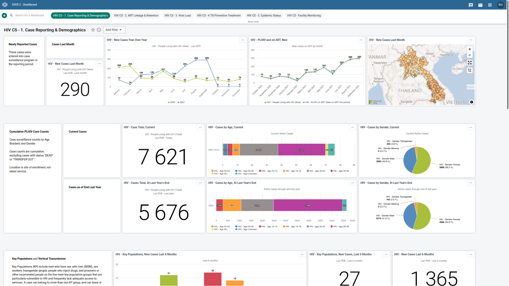

Newly reported cases by month, geography, and key population group. Cumulative cases registered by age ranges, gender.
- How has registration of new HIV cases changed this year compared to last?
- Have most new HIV cases also initiated ART?
- Is the epidemic concentrated in a certain KP group or region?

**HIV CS - 2. ART Linkage & Retention**

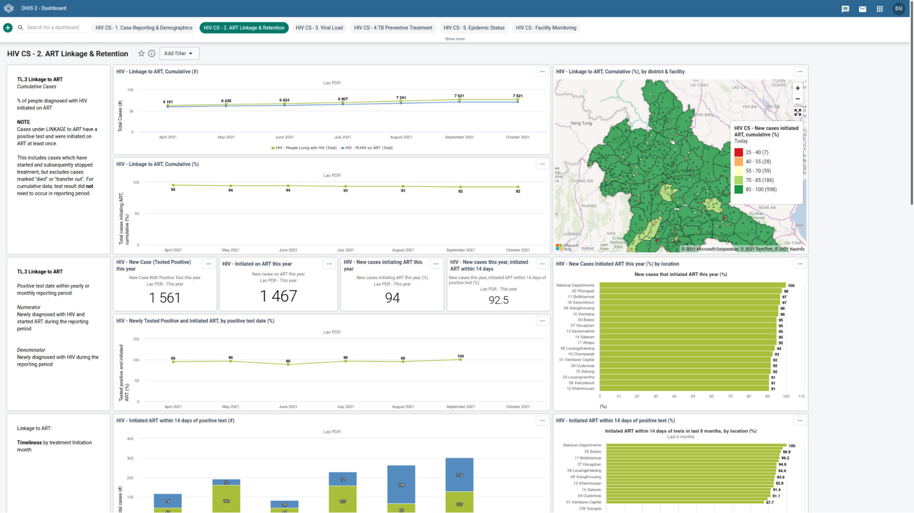

Cumulative cases that initiate and continue ART on a routine basis. Examines patient status reported last month, and attrition or mortality over time.
-  How has linkage to ART improved over time? Are there any hotspot districts or clinics where ART linkage is significantly lower?
-  How many patients initiated ART on the same day of  their positive test result?
-   How many within 14 days? 
-   What are the patterns of patients lost to follow up at visits last month by gender? By district?
-   Has ART attrition generally increased in the last 6 months? 

**HIV CS - 3. Viral Load**

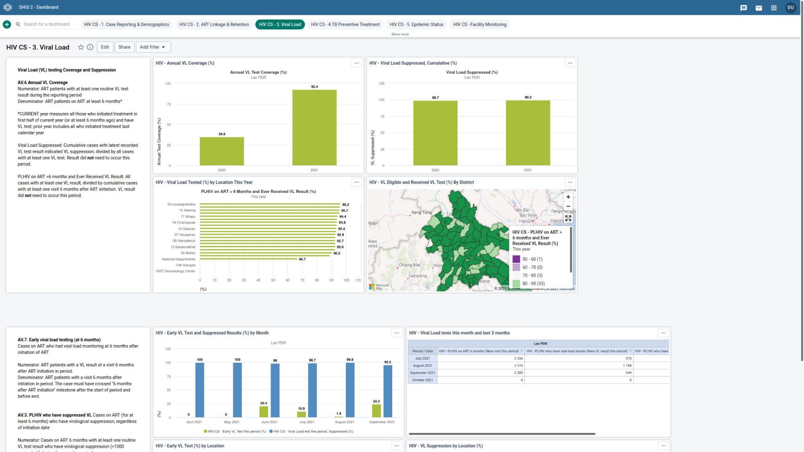

Viral Load testing coverage and viral load suppression among all patients on ART more than 6 months.
- Are 95% of cases with have a viral load test in viral load suppression?
- Has that improved since last year?
- Of all cases that have been on ART for at least 6 months and are still active, how many have ever had a viral load test?
- Last month, how many cases that had their first visit after 6 months on ART also had a viral load test in the month? Does this vary by district?

**HIV CS - 4. TB Preventive Treatment**

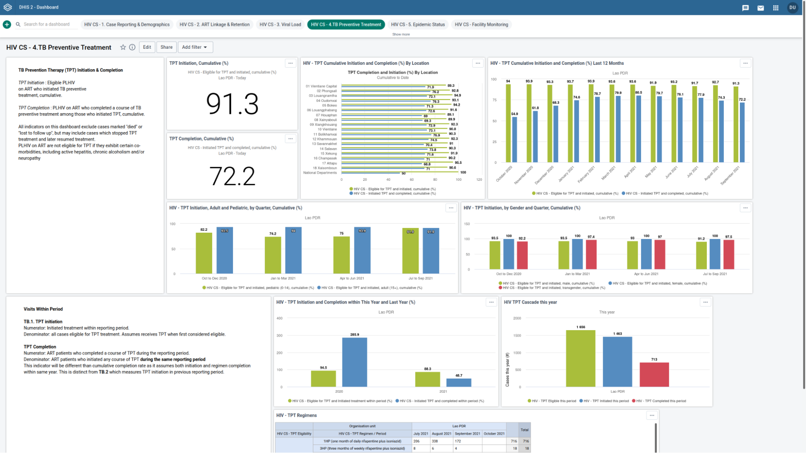

TB Prevention Therapy (TPT) initiation and completion, cumulative by ange and gender, as well as TPT Regimens.
- What is the cascade of total HIV cases with TPT eligibility, initiation, and completion this year? 
- Have completion rates for TPT increased over the past 12 months? 
- Are eligible adults more likely to initiate TPT than eligible children? 
- Are there patterns by gender? 

**HIV CS - 5. Epidemic Status**

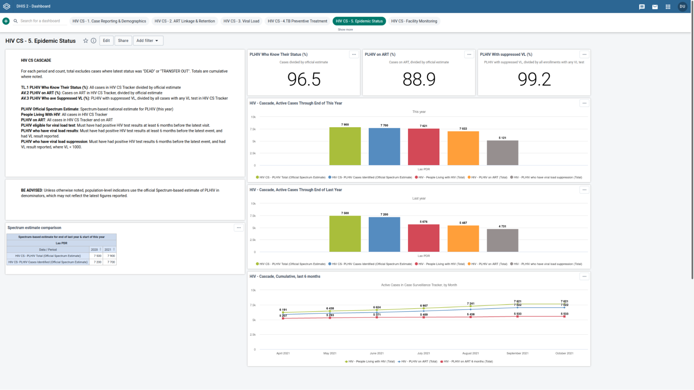

HIV Cascade with case surveillance data plus aggregate spectrum estimates as annual population-level denominators.
- Is my region reaching 95/95/95 targets?
- Are enough cases enrolled in the HIV CS Tracker to compare with the national spectrum estimate for total cases identified?
- How have cases with VL suppression increased this year compared to the end of last year?
- Over the preceding 6 months, how many PLHIV have initiated ART?

**HIV CS - Facility Monitoring**

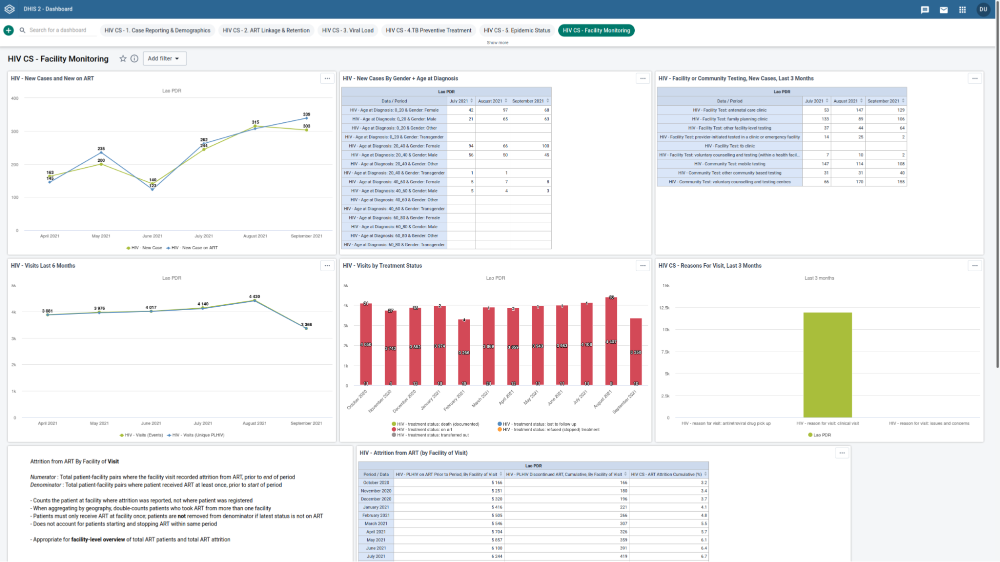

Encounter-based indicators specifically designed for monitoring HIV CS roll-out at facility level, including new cases on ART, testing site, and latest status not on ART.
-What was the most common age and gender combination for new cases last month?
-Have “lost-to-follow-up” reports increased or decreased over prior 12 months at my facility?
-What was the most frequent reason for patient visits over the last 3 months?
-Which patients had reportedly discontinued ART last month at my facility? 

### Indicators and Program Indicators

Included within the package there are 116 program indicators and XYZ indicators, based on individual-level data gathered in the Tracker system. As a general rule, program indicators count HIV cases meeting specific criteria; indicators are percentages based on those counts. These program indicators and indicators populate charts, maps, and tables which are shown on the dashboards.

Special attention should be made to program indicators marked “cumulative”, which identify all cases that meet the specified criteria before the end of a given period, regardless of when they enrolled in the system, and make use of open “analytic period boundaries”. Note that additional disaggregation of all program indicators can be configured for local context through consulting the DHIS2 User Guide. (<https://docs.dhis2.org/en/use/user-guides/dhis-core-version-236/analysing-data/data-visualizer.html>)

| pi_name | pi_shortname | pi_desc | pi_type |
|:---:|:---:|:---:|:---:|
| HIV - Age 00-04 | PLHIV (0-4, Total) | Everyone enrolled in this programme is a PLHIV except those who have transferred out and those who have died. Age at enrollment. | ENROLLMENT |
| HIV - Age 05-09 | PLHIV (5-9 Age, Total) | Everyone enrolled in this programme is a PLHIV except those who have transferred out and those who have died. | ENROLLMENT |
| HIV - Age 10-14 | PLHIV (10-14, Total) | Everyone enrolled in this programme is a PLHIV except those who have transferred out and those who have died. | ENROLLMENT |
| HIV - Age 15-19 | PLHIV (15-19 Age, Total) | Everyone enrolled in this programme is a PLHIV except those who have transferred out and those who have died. | ENROLLMENT |
| HIV - Age 20-24 | PLHIV (20-24 Age, Total) | Everyone enrolled in this programme is a PLHIV except those who have transferred out and those who have died. | ENROLLMENT |
| HIV - Age 25-49 | PLHIV (25-49 Age, Total) | Everyone enrolled in this programme is a PLHIV except those who have transferred out and those who have died. | ENROLLMENT |
| HIV - Age 50+ | PLHIV (50+ Age, Total) | Everyone enrolled in this programme is a PLHIV except those who have transferred out and those who have died. | ENROLLMENT |
| HIV - Age at Diagnosis: 0_20 | HIV AGE AT DIAGNOSIS: 0_20 |  | EVENT |
| HIV - Age at Diagnosis: 0_20 & Gender: Female | HIV AGE AT DIAGNOSIS: 0_20 & GEN..._COMBO_4 |  | EVENT |
| HIV - Age at Diagnosis: 0_20 & Gender: Male | HIV AGE AT DIAGNOSIS: 0_20 & GEN..._COMBO_5 |  | EVENT |
| HIV - Age at Diagnosis: 0_20 & Gender: Other | HIV AGE AT DIAGNOSIS: 0_20 & GEN..._COMBO_6 |  | EVENT |
| HIV - Age at Diagnosis: 0_20 & Gender: Transgender | HIV AGE AT DIAGNOSIS: 0_20 & GEN..._COMBO_7 |  | EVENT |
| HIV - Age at Diagnosis: 20_40 | HIV AGE AT DIAGNOSIS: 20_40 |  | EVENT |
| HIV - Age at Diagnosis: 20_40 & Gender: Female | HIV AGE AT DIAGNOSIS: 20_40 & GE..._COMBO_10 |  | EVENT |
| HIV - Age at Diagnosis: 20_40 & Gender: Male | HIV AGE AT DIAGNOSIS: 20_40 & GE..._COMBO_11 |  | EVENT |
| HIV - Age at Diagnosis: 20_40 & Gender: Other | HIV AGE AT DIAGNOSIS: 20_40 & GE..._COMBO_12 |  | EVENT |
| HIV - Age at Diagnosis: 20_40 & Gender: Transgender | HIV AGE AT DIAGNOSIS: 20_40 & GE..._COMBO_13 |  | EVENT |
| HIV - Age at Diagnosis: 40_60 | HIV AGE AT DIAGNOSIS: 40_60 |  | EVENT |
| HIV - Age at Diagnosis: 40_60 & Gender: Female | HIV AGE AT DIAGNOSIS: 40_60 & GE..._COMBO_15 |  | EVENT |
| HIV - Age at Diagnosis: 40_60 & Gender: Male | HIV AGE AT DIAGNOSIS: 40_60 & GE..._COMBO_16 |  | EVENT |
| HIV - Age at Diagnosis: 40_60 & Gender: Other | HIV AGE AT DIAGNOSIS: 40_60 & GE..._COMBO_17 |  | EVENT |
| HIV - Age at Diagnosis: 40_60 & Gender: Transgender | HIV AGE AT DIAGNOSIS: 40_60 & GE..._COMBO_18 |  | EVENT |
| HIV - Age at Diagnosis: 60_80 | HIV AGE AT DIAGNOSIS: 60_80 |  | EVENT |
| HIV - Age at Diagnosis: 60_80 & Gender: Female | HIV AGE AT DIAGNOSIS: 60_80 & GE..._COMBO_19 |  | EVENT |
| HIV - Age at Diagnosis: 60_80 & Gender: Male | HIV AGE AT DIAGNOSIS: 60_80 & GE..._COMBO_20 |  | EVENT |
| HIV - Age at Diagnosis: 60_80 & Gender: Other | HIV AGE AT DIAGNOSIS: 60_80 & GE..._COMBO_21 |  | EVENT |
| HIV - Age at Diagnosis: 60_80 & Gender: Transgender | HIV AGE AT DIAGNOSIS: 60_80 & GE..._COMBO_22 |  | EVENT |
| HIV - Age Unknown | PLHIV (Unknown Age, Total) | Everyone enrolled in this programme is a PLHIV except those who have transferred out and those who have died. | ENROLLMENT |
| HIV - Community Test: mobile testing | HIV Community Test: MOBILE TESTING ... |  | EVENT |
| HIV - Community Test: other community based testing | HIV Community Test: OTHER COMMUNITY... |  | EVENT |
| HIV - Community Test: voluntary counselling and testing centres | HIV Community Test: VOLUNTARY COUNS... |  | EVENT |
| HIV - currently pregnant | HIV CURRENTLY PREGNANT |  | EVENT |
| HIV - Days Since Treatment Start | HIV Days Since Start |  | ENROLLMENT |
| HIV - Facility Test: antenatal care clinic | HIV Facility Test: ANTENATAL CARE ... |  | EVENT |
| HIV - Facility Test: family planning clinic | HIV Facility Test: FAMILY PLANNING... |  | EVENT |
| HIV - Facility Test: other facility-level testing | HIV Facility Test: OTHER FACILITY-... |  | EVENT |
| HIV - Facility Test: provider-initiated tested in a clinic or emergency facility | HIV Facility Test: PROVIDER-INITIA... |  | EVENT |
| HIV - Facility Test: tb clinic | HIV Facility Test: TB CLINIC |  | EVENT |
| HIV - Facility Test: voluntary counselling and testing (within a health facility setting) | HIV Facility Test: VOLUNTARY COUNS... |  | EVENT |
| HIV - Gender Female | PLHIV (Female, Total) | Everyone enrolled in this programme is a PLHIV except those who have transferred out and those who have died. | ENROLLMENT |
| HIV - Gender Male | PLHIV (Male, Total) | Everyone enrolled in this programme is a PLHIV except those who have transferred out and those who have died. | ENROLLMENT |
| HIV - Gender Missing | PLHIV (NA Gender, Total) | Everyone enrolled in this programme is a PLHIV except those who have transferred out and those who have died. | ENROLLMENT |
| HIV - Gender Transgender | PLHIV (TG, Total) | Everyone enrolled in this programme is a PLHIV except those who have transferred out and those who have died. | ENROLLMENT |
| HIV - Initiated on ART 1-14 days after test | HIV initiated on ART 1-14 days after test | How many people have started their treatment within 14 days of enrollment | ENROLLMENT |
| HIV - Initiated on ART 15+ days after test | HIV initiated on ART 15+ days after test | How many people have started their treatment within 14 days of enrollment | ENROLLMENT |
| HIV - Initiated on ART and Died, Cumulative | HIV patient death under treatment | Patients being surveilled who died whilst under surveillance | ENROLLMENT |
| HIV - Initiated on ART and Lost to Follow Up, Cumulative | HIV patient LTFU under treatment | Patients being surveilled who are last reported as "lost to follow up" while being treated | ENROLLMENT |
| HIV - Initiated on ART and Transfer Out, Cumulative | HIV patient transferred out under treatment | Patients being surveilled who are last reported as "transferred out" while being treated | ENROLLMENT |
| HIV - Initiated on ART, Cumulative | HIV patients ever under treatment | Patients being surveilled, including those that were died, transferred out, or lost to follow up | ENROLLMENT |
| HIV - Initiated on ART same day as test | HIV Initiated on ART same day as test | HIV Initiated on treatment same day as positive test | ENROLLMENT |
| HIV - Initiated on ART within this period | HIV initiated on ART this period |  | ENROLLMENT |
| HIV - Key Pop: Any Group | HIV KEY POPULATION: Any |  | EVENT |
| HIV - Key Pop: Injection Drug Use | HIV Key Pop: Injection Drug Use |  | EVENT |
| HIV - Key Pop: More than one group | HIV Key Pop: More than 1 group |  | EVENT |
| HIV - Key Pop: MSM | HIV Key Pop: MSM |  | EVENT |
| HIV - Key Pop: Prisoner | HIV Key Pop: Prisoner |  | EVENT |
| HIV - Key Pop: Sex Worker | HIV Key Pop: Sex Worker |  | EVENT |
| HIV - Key Pop: Transgender | HIV Key Pop: Transgender |  | EVENT |
| HIV - New Case | HIV New Case |  | EVENT |
| HIV - New Case on ART | HIV New Case on ART |  | EVENT |
| HIV - New Cases, Female | HIV_NEW_CASE GENDER: FEMALE |  | EVENT |
| HIV - New cases, Male | HIV NEW CASE GENDER: MALE |  | EVENT |
| HIV - New cases, Other gender | HIV NEW CASE GENDER: OTHER |  | EVENT |
| HIV - New cases, Transgender | HIV NEW CASE GENDER: TRANSGENDER |  | EVENT |
| HIV - People Living with HIV (New) | PLHIV (New) | Everyone enrolled in this programme is a PLHIV except those who have transferred out and those who have died. By NEW CASE REPORT date. | ENROLLMENT |
| HIV - People Living with HIV (Total) | PLHIV (Total) | Everyone enrolled in this programme is a PLHIV except those who have transferred out and those who have died | ENROLLMENT |
| HIV - PLHIV Discontinued ART, Cumulative, By Facility of Visit | PLHIV_on_ART_DISCONTINUED_VISIT_CUMU | Everyone enrolled in this programme is a PLHIV except those who have transferred out and those who have died. ART start date must be before start of reporting period. Counting all patients who discontinued ART at facility before end of period. This method double counts patient-OU pairings, not unique patients, and should be interpreted with caution. | EVENT |
| HIV - PLHIV, Discontinued ART within Period, By Facility of Registration | PLHIV on ART (Total, including dropouts) | Everyone enrolled in this programme is a PLHIV except those who have transferred out and those who have died. ART start date must be before start of reporting period. | ENROLLMENT |
| HIV - PLHIV on ART 6 months (New visit this period) | PLHIV, viral load eligible (Visited) | Everyone enrolled in this programme is a PLHIV except those who have transferred out and those who have died. Must have had HIV test results 6 months before the latest event. Must have had a visit within the period | ENROLLMENT |
| HIV - PLHIV on ART 6 months this period | PLHIV, viral load newly eligible this period | Everyone enrolled in this programme is a PLHIV except those who have transferred out and those who have died. Must have had HIV test results 6 months before point within the period, "crossing" the eligibility window. | ENROLLMENT |
| HIV - PLHIV on ART 6 months this period and received VL results | PLHIV, new viral load with results | Everyone enrolled in this programme is a PLHIV except those who have transferred out and those who have died. Must have had HIV test results 6 months before point within the period, "crossing" the eligibility window. | ENROLLMENT |
| HIV - PLHIV on ART 6 months (Total) | PLHIV, viral load eligible (total) | Everyone enrolled in this programme is a PLHIV except those who have transferred out and those who have died. Must have had HIV test results 6 months before the latest event. | ENROLLMENT |
| HIV - PLHIV on ART (New on ART this period) | PLHIV on ART (New) | Everyone enrolled in this programme is a PLHIV except those who have transferred out and those who have died | ENROLLMENT |
| HIV - PLHIV on ART Prior To Period, By Facility of Registration | HIV PLHIV on ART (Total, Prior to Period) | Everyone enrolled in this programme is a PLHIV except those who have transferred out and those who have died. Examining BEFORE THIS PERIOD to compare with current period and examine attrition. ART start date must be before start of reporting period. | ENROLLMENT |
| HIV - PLHIV on ART Prior to Period, By Facility of Visit | PLHIV on ART_PRIOR_VISIT | Everyone enrolled in this programme is a PLHIV except those who have transferred out and those who have died. Examining BEFORE THIS PERIOD to compare with current period and examine attrition. ART start date must be before start of reporting period. This method double counts patient-OU pairings, not unique patients, and should be interpreted with caution. | EVENT |
| HIV - PLHIV on ART (Total) | PLHIV on ART (Total) | Everyone enrolled in this programme is a PLHIV except those who have transferred out and those who have died | ENROLLMENT |
| HIV - PLHIV who have viral load results (New VL result this period) | PLHIV with viral load results (new) | Everyone enrolled in this programme is a PLHIV except those who have transferred out and those who have died. Must have had HIV test results 6 months before the latest event. | ENROLLMENT |
| HIV - PLHIV who have viral load results (Total) | PLHIV with viral load results | Everyone enrolled in this programme is a PLHIV except those who have transferred out and those who have died. Must have had HIV test results 6 months before the latest event. | ENROLLMENT |
| HIV - PLHIV who have viral load suppression (New VL result this period) | PLHIV with viral load suppression, new | Everyone enrolled in this programme is a PLHIV except those who have transferred out and those who have died. Must have had HIV test results 6 months before the latest event. VL < 1000 | ENROLLMENT |
| HIV - PLHIV who have viral load suppression (Total) | PLHIV with viral load suppression | Everyone enrolled in this programme is a PLHIV except those who have transferred out and those who have died. Must have had HIV test results 6 months before the latest event. VL < 1000 | ENROLLMENT |
| HIV - PLHIV with more than 28 days since the end of last prescription period | HIV No medicine 28 days or more |  | ENROLLMENT |
| HIV - Reason for Visit: antiretroviral drug pick up | HIV REASON FOR VISIT: ANTIRETROVIRAL DRUG ... |  | EVENT |
| HIV - Reason for Visit: clinical visit | HIV REASON FOR VISIT: CLINICAL VISIT |  | EVENT |
| HIV - Reason for Visit: issues and concerns | HIV REASON FOR VISIT: ISSUES AND CONCERNS |  | EVENT |
| HIV - Reported Death | HIV patient death | Patients being surveilled who died whilst under surveillance | EVENT |
| HIV - Reported Lost To Follow Up | HIV patient LTFU | Patients being surveilled who are lost to follow up whilst under surveillance | EVENT |
| HIV - Reported Move To Different Location | HIV patient transferred | Patients being surveilled who arre reported transferred out or "moved to a different location" | EVENT |
| HIV - Reported Stopped Treatment | HIV patient stopped treatment | Patients who are reported stopped treatment | EVENT |
| HIV - Tested positive within period | HIV Tested positive |  | ENROLLMENT |
| HIV - Tested positive within period & Initiated on ART | HIV, , tested positive, initiated on ART |  | ENROLLMENT |
| HIV - TPT Completed, cumulative | HIV TPT Completed, cumulative |  | ENROLLMENT |
| HIV - TPT Completed this period | HIV TPT Completed this period |  | ENROLLMENT |
| HIV - TPT Eligible, cumulative | HIV TPT Eligible, cumulative |  | ENROLLMENT |
| HIV - TPT Eligible, cumulative (Adult, age 15+) | HIV TPT Eligible, cumulative, 15+ | Age is as of the date eligible for TPT | ENROLLMENT |
| HIV - TPT Eligible, cumulative (Male) | HIV TPT Eligible, cumulative, male |  | ENROLLMENT |
| HIV - TPT Eligible, cumulative (Pediatric, age 0-14) | HIV TPT Eligible, cumulative, 0-14 | Age is as of the date eligible for TPT | ENROLLMENT |
| HIV - TPT Eligible, cumulative (Transgender) | HIV TPT Eligible, cumulative, transgender |  | ENROLLMENT |
| HIV - TPT Eligible this period | HIV TPT Eligible this period |  | ENROLLMENT |
| HIV - TPT Initiated, cumulative | HIV TPT Initiated, cumulative |  | ENROLLMENT |
| HIV - TPT Initiated, cumulative (Adult, age 15+) | HIV TPT Initiated, cumulative, 15+ | Age is as of TPT eligible date | ENROLLMENT |
| HIV - TPT Initiated, cumulative (Female) | HIV TPT Initiated, cumulative, female |  | ENROLLMENT |
| HIV - TPT Initiated, cumulative (Male) | HIV TPT Initiated, cumulative, male |  | ENROLLMENT |
| HIV - TPT Initiated, cumulative (Pediatric, age 0-14) | HIV TPT Initiated, cumulative, 0-14 | Age is as of TPT eligible date | ENROLLMENT |
| HIV - TPT Initiated, cumulative (Transgender) | HIV TPT Initiated, cumulative, transgender |  | ENROLLMENT |
| HIV - TPT Initiated this period | HIV TPT Initiated this period |  | ENROLLMENT |
| HIV - Treatment Status: Changed | HIV - TREATMENT STATUS: CHANGED |  | EVENT |
| HIV - Treatment Status: death (documented) | HIV TREATMENT STATUS: DEATH (DOCUMENTED) |  | EVENT |
| HIV - Treatment Status: lost to follow up | HIV TREATMENT STATUS: LOST TO FOLLOW UP |  | EVENT |
| HIV - Treatment Status: on art | HIV TREATMENT STATUS: ON ART |  | EVENT |
| HIV - Treatment Status: refused (stopped) treatment | HIV TREATMENT STATUS: REFUSED (STOPPED) TR... |  | EVENT |
| HIV - Treatment Status: transferred out | HIV TREATMENT STATUS: TRANSFERRED OUT |  | EVENT |
| HIV - Vertical Transmission | HIV VERTICAL TRANSMISSION |  | EVENT |
| HIV - Visits (Events) | HIV Visit Events |  | EVENT |
| HIV - Visits (Unique PLHIV) | HIV visit persons |  | EVENT |
| HIV - VL Test Annual Denominator | HIV VL Test ANNUAL Denom | Only for annual level. If the current year, includes those who tested positive in first half. If last year, includes all who tested positive. | ENROLLMENT |
| HIV - VL Test Annual Numerator | VL Test ANNUAL Num | Only for annual level. If reporting period is this year, and in second half of year, include from first half of the year. If reporting period is this year and in first half, no one positive this year is eligible. If last year, all positive cases from that year are eligible for test this year. | ENROLLMENT |

### Ownership Analytics in DHIS2 version 40

If a program indicator analyzes patient data entered across two events or more, this is made possible through an _enrollment-type_ program indicator.

In DHIS2 version 2.39 and below, DHIS2 program indicators cannot differentiate between the _ownership_ org unit and the _enrollment_ org unit. In practical terms, this means that when a patient has moved between sites, all longitudinal indicators for this patient are not re-assigned to the patient’s latest site, and remain assigned to the initial site where the patient first entered the program. This is a critical limitation which package implementers must consider, especially when interpreting longitudinal case surveillance indicators such as mortality rates and attrition rates.

In [DHIS2 version 40](https://docs.dhis2.org/en/implement/software-release-information/dhis2-core-releases/dhis-core-version-240/release-notes.html) program indicators based on ownership organization unit were introduced. For example, you can count the number of unique PLHIV that are receiving care at a facility even if they were not originally enrolled in care at that facility or officially transferred. Specifically, program indicators can define which ***organisation unit dimension*** to be used in analytics. Choices include the organisation unit for the event, enrollment, registration, organisation unit data element and tracked entity instance ownership at the *start or end* of the reporting period.

More detailed guidance about Ownership Analytics can be found in the [Tracker Design Guide](https://docs.dhis2.org/en/implement/database-design/tracker-system-design/tracker-analytics.html#common-challenge-3-transfers-and-ownership), and in the [Jira ticket for this feature](https://dhis2.atlassian.net/browse/DHIS2-11597).

When upgrading to version 40, program indicators will default to the same organization unit dimension as prior versions: event-type program indicators will use Event organization unit, and enrollment-type use enrollment organization unit. The version 40 compatible HIV CS metadata package does not automatically update Program Indicators to ownership at start or end of period.

>  **Warning**
>
> It is the responsibility of the implementer to decide what type of organization unit dimension to assign to each program indicator, according to national guidelines and in consultation with end users.

## Metadata

On our github repository you can find the link to the latest version of the metadata. Note that this is not the final version of this package and it will be updated as soon as possible:
[Link to github](https://github.com/dhis2/metadata-package-development/tree/master/metadata/HIV_Tracker)

## Android Compatibility

The package is natively compatible with the DHIS2 Data Capture app for android. There are, however, some considerations to be aware of when implementing this package with android devices:

### Automatically Assigned UiDs

If you will be using android devices, and you will be using automatically generated IDs which are sequential or based on dates, you need to be aware that in order to be able to work offline, android devices reserve sets of UiDs in bulk in advance. This means that the UiDs assigned may not necessarily correspond with the chronological order in which the patients are registered. For more information see [here](https://docs.dhis2.org/en/implement/android-implementation/dhis2-configuration-for-android.html#implementation_guide_dhis2_config_reserved_id).

### Search Functionality

Note that for android-based implementations, if you want users to be able to search clients in a different org unit than their own, the search settings MUST be set to “open” as the other search features are not fully supported. More information available [here](https://docs.dhis2.org/en/full/implement/dhis2-android-configuration-guide.html).
