PAHO HIV Prevention Toolkit - Documento de Diseño del Sistema

# Toolkit de Prevención de VIH en DHIS2 para OPS - Documento de Diseño del Sistema

## Antecedentes y Propósito
El Toolkit de Prevención de VIH en DHIS2 para OPS es un sistema de seguimiento de prevención de VIH basado en DHIS2 Tracker que permite rastrear los eventos de prevención que experimenta un individuo.

Este toolkit se ha desarrollado con el propósito de agilizar la implementación de programas de prevención de VIH en países que carecen de un sistema informático de registro de actividades. Incluye un componente analítico configurado para calcular los indicadores clave de un programa de prevención. Se trata de una configuración mínima diseñada para facilitar el proceso de implementación y debe adaptarse a casos de uso específicos y contextos nacionales.

El sistema se fundamenta en las directrices del "Marco de Monitoreo de los Servicios Relacionados con el VIH y las ITS para Grupos de Población Clave en América Latina y el Caribe" (OPS, 2019) y se desarrolla bajo la orientación del Departamento de VIH de OPS.

##  Resumen del Diseño del Sistema
### Casos de Uso

El uso típico de este toolkit es el seguimiento de servicios prestados a individuos dentro de poblaciones clave que están recibiendo servicios de prevención de VIH debido a su riesgo específico. Es posible realizar modificaciones para incluir otros grupos y combinarlo con otros servicios, como el seguimiento de casos de pacientes con VIH. El sistema se basa en el seguimiento de datos individuales a lo largo del tiempo, y los indicadores se calculan utilizando indicadores de programa que luego se agregan a los indicadores tradicionales en un conjunto de datos agregados.

El toolkit está creado como una estructura mínima, y deberá pasar por un proceso de adaptación riguroso antes de poder pasar a producción en un país.
  
###  Estructura del Programa

El siguiente diagrama muestra la estructura del programa:

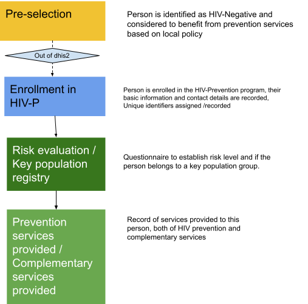

  
#### Justificación de la Estructura del Programa

La estructura del programa se ha diseñado de manera estratégica para garantizar la eficacia y la privacidad de los datos. Aquí se presenta la justificación clave:

- **Entidad "Persona":** El programa utiliza una entidad denominada "Persona" que comparte atributos básicos con otros programas de seguimiento. Esto permite una gestión más eficiente de los datos de las personas, evitando duplicaciones y mejorando la coherencia en la información.

- **Registro Separado para Datos Clave de la Población:** Los datos relacionados con la población clave se registran en una etapa no repetible que está separada de la inscripción principal. Esta separación permite una compartimentalización adecuada de los datos relacionados con la actividad sexual e identidad sexual, garantizando la confidencialidad y el acceso restringido a esta información.

- **Etapa Repetible (Visita):** Para capturar de manera efectiva todas las actividades en las que una persona participa, se ha incluido una etapa repetible llamada "Visita". Esta etapa se utiliza para registrar todos los datos relevantes relacionados con las actividades de prevención de VIH en las que la persona está involucrada, lo que proporciona un registro completo y detallado de su participación.

Esta estructura de programa permite una gestión eficiente de los datos, protege la privacidad de los individuos y ayuda a que se registren de manera exhaustiva todas las actividades relacionadas con la prevención de VIH sin recurrir a multiples etapas.

## Usuarios Previstos

El toolkit considera usuarios de entrada de datos, acceso a análisis, visualizaciones y tableros, y administración de metadatos. Se prevee que los datos sean ingresados al nivel mas bajo posible, normalmente en un punto de atención, pero es entendido que en muchos casos, la entrada de datos será secundaria. 

Los tableros están configurados a nivel nacional y subnacional. 
  

## Configuración 

El programa no cuenta con configuraciones específicas ya que es una propuesta mínima que deberá adaptarse a necesidades locales considerando las normativas de protección de datos y el uso del sistema. Se prevé que el programa tenga acceso limitado a los usuarios de la unidad organizativa, pero que se puedan buscar usuarios en otras unidades cuando sea necesario el acceso.

A continuación describimos la configuración de atributos, etapas y elementos de datos del programa. Los nombres reflejados no son los que se muestran en la interfaz, sino los nombres de los elementos de datos utilizados en el backend.

## Inscripción
Los siguientes atributos son parte de la inscripción. Todos deberán ser adaptados a las necesidades nacionales.

| Buscable | Nombre (Español)                                | Nombre (Inglés)  | UiD               | Tipo de valor           | Set de opciones (si corresponde)   |
| -------- | --------------------------------------------- | ----------------- | ----------------- | ------------------------ | ---------------------------------- |
| N/A      | Fecha de Inscripción                          | Registration Date | mD02n8fmxDF       | DATE                     |                                    |
| Si       | Apellidos                                      | Family Name      | ENRjVGxVL6l       | TEXT                     |                                    |
| Si       | Nombres                                        | Given Name       | sB1IHYu2xQT       | TEXT                     |                                    |
| No       | Apodo                                          | Social Name (if applicable) | seG9DORjRe3       | TEXT  |                                    |
| Si       | Fecha de Nacimiento                            | Date of Birth    | NI0QRzJvQ0k       | DATE                     |                                    |
| NO       | Fecha de nacimiento desconocida               | Date of Birth Unknown | EzjzXNnQk0Z | TRUE_ONLY                |                                    |
| NO       | Edad en Meses                                 | Age - Months     | o5VnbR7haRe       | INTEGER_ZERO_OR_POSITIVE |                                    |
| NO       | Edad en años                                  | Age - Years      | lAsTkcV1fvw       | INTEGER_ZERO_OR_POSITIVE |                                    |
| NO       | Dirección                                      | Address (current)| A6Hb0Kvg4vb       | TEXT                     |                                    |
| NO       | Teléfono de contacto local                     | Contact Phone Number (local)| fctSQp5nAYl | PHONE_NUMBER             |                                    |
| NO       | Nacionalidad                                   | Nationality      | pt8XLGpf37J       | TEXT                     | ISO Country list                   |
| NO       | Tipo de documento                              | Type of Document | cRBWATXTrTM       | TEXT                     | NATIONAL_ID, PASSPORT, WORK_PERMIT, REFUGE_CARD, APPLICATION_FOR_REFUGE, OTHER |
| NO       | Especifique otro tipo de documento             | Specify Other Type of Document | Ybj656vEDVT  | TEXT              |                                    |
| NO       | Número de documento                            | Document Number  | QmI1CtwM8Pp       | TEXT                     |                                    |

## Etapa de identificación de población

En esta etapa se registran los datos básicos sobre el estado de población clave de la persona, basados en lo estipulado en el marco de monitoreo. Si hay un cambio en el estado de población clave, por ejemplo, si el paciente ya no está encarcelado, los datos registrados en esta etapa deberán editarse.

Esta etapa incluye reglas de programa preconfiguradas con un algoritmo para determinar la población clave basadas en preguntas estandarizadas propuestas por el marco de monitoreo, en particular para determinar si la persona es HSH.

| Nombre en Español                                     | Name                                              | UiD               | Tipo de valor           | Set de opciones (si aplica)   | Requerido |
| ----------------------------------------------------- | ------------------------------------------------- | ----------------- | ------------------------ | ---------------------------- | --------- |
| Fecha del Evento                                     | Event Date                                        | aGPndpKweJK       | DATE                     | TRUE                         | TRUE      |
| Identidad de Género Asignada al Nacer (HIVp_PAHO)    | HIVp_PAHO - Sex assigned at birth                | SAUZrNggPyE       | TEXT                     | MALE, FEMALE, INTERSEX, OTHER, NO_ANSWER | FALSE     |
| Especifique otra identidad de género asignada al nacer (HIVp_PAHO) | HIVp_PAHO - Specify other sex assigned at birth | XShuYnYsM9u       | TEXT                     |                              | FALSE     |
| Con quién ha tenido relaciones sexuales (HIVp_PAHO)   | HIVp_PAHO - 1. Who have you had sexual relations with? | PVIx3CbZFKJ       | TEXT                     | WOMEN, MEN, TRANSGENDER_WOMEN, TRANSGENDER_MEN, OTHER, NO_ANSWER | FALSE |
| Con quién ha tenido relaciones sexuales (HIVp_PAHO)   | HIVp_PAHO - 2. Who have you had sexual relations with? | jZ49hY46U3A       | TEXT                     | WOMEN, MEN, TRANSGENDER_WOMEN, TRANSGENDER_MEN, OTHER, NO_ANSWER | FALSE |
| Con quién ha tenido relaciones sexuales (HIVp_PAHO)   | HIVp_PAHO - 3. Who have you had sexual relations with? | POIfQreeyow       | TEXT                     | WOMEN, MEN, TRANSGENDER_WOMEN, TRANSGENDER_MEN, OTHER, NO_ANSWER | FALSE |
| Con quién ha tenido relaciones sexuales (HIVp_PAHO)   | HIVp_PAHO - 4. Who have you had sexual relations with? | TQUrEv4MKuQ       | TEXT                     | WOMEN, MEN, TRANSGENDER_WOMEN, TRANSGENDER_MEN, OTHER, NO_ANSWER | FALSE |
| Con quién ha tenido relaciones sexuales (HIVp_PAHO)   | HIVp_PAHO - 5. Who have you had sexual relations with? | IPDwJEIYrTF       | TEXT                     | WOMEN, MEN, TRANSGENDER_WOMEN, TRANSGENDER_MEN, OTHER, NO_ANSWER | FALSE |
| Especifique otro grupo de población con el que ha tenido relaciones sexuales (HIVp_PAHO) | HIVp_PAHO - Specify other group of population you have had sexual relations | AlS67CUzJh3 | TEXT | | FALSE |
| Intercambio de sexo por dinero o bienes en los últimos 12 meses (HIVp_PAHO) | HIVp_PAHO - Exchanged sex for money or goods in the last 12 months | EEZ8qe0slpg | TEXT | YES, NO, NO_ANSWER | FALSE |
| Compartió una aguja y/o jeringa para inyectar sustancias en los últimos 12 meses (HIVp_PAHO) | HIVp_PAHO - Shared a needle and/or syringe to inject substances in the last 12 months | ZZLPgLPzRLQ | TEXT | YES, NO, NO_ANSWER | FALSE |
| Identidad de Género (HIVp_PAHO) | HIVp_PAHO - What is your gender identity? | MZVdlRUalzP | TEXT | MAN, WOMAN, TRANSGENDER_WOMAN, TRANSGENDER_MAN, OTHER, NO_ANSWER | FALSE |
| Especifique otra autoidentificación (HIVp_PAHO) | HIVp_PAHO - Specify other autoidentification | yG3E2qgI7uI | TEXT | | FALSE |

###  Visitas 

La sección de visitas captura todas las actividades que pueden ocurrir durante una visita de prevención. Se inicia con un cuestionario inicial y en base a las respuestas se sugieren actividades preventivas. Cada actividad se incluye dentro de una sección, y estas secciones se muestran u ocultan según sea necesario.

Además, hay una sección oculta (marcada como OCULTA en la hoja de cálculo) que se utiliza para calcular los indicadores.

**Sección Oculta**

*Usada para calcular indicadores*

Para poder contar correctamente algunos de los indicadores basados en población clave, los datos de población son guardados en elementos de datos que permanecen en una sección oculta, utilizando reglas de programa. Los indicadores de programa que se basan en estos elementos de datos son 2.2, 2.3 y 2.4. y todos aquellos que filtren por HIV negativo

Dichos elementos de dato están marcados con el sufijo - VISIT STAGE en su nombre:

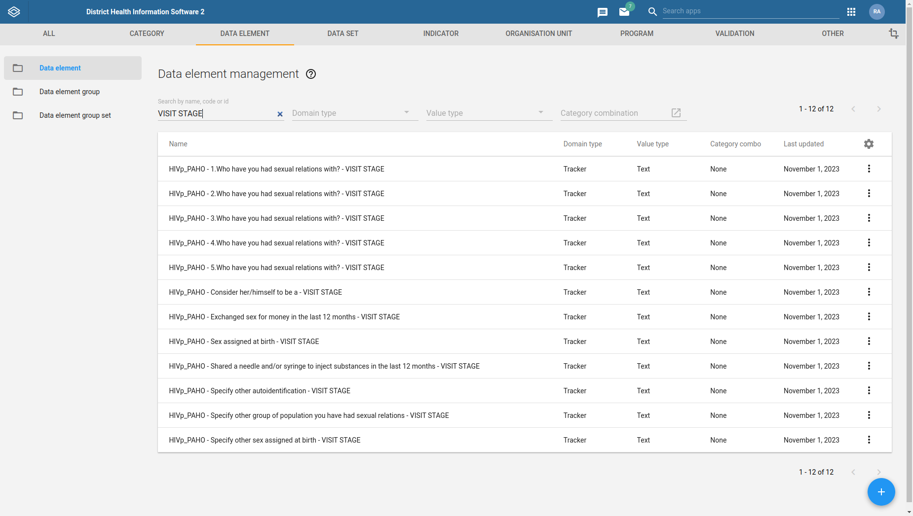

**Detalles de la Visita:**

En la sección de Detalles de la visita, se podrá registrar de manera manual las tareas planteadas para la sesión. Por cada una de las actividades seleccionadas se abrirá una nueva sección con más información.

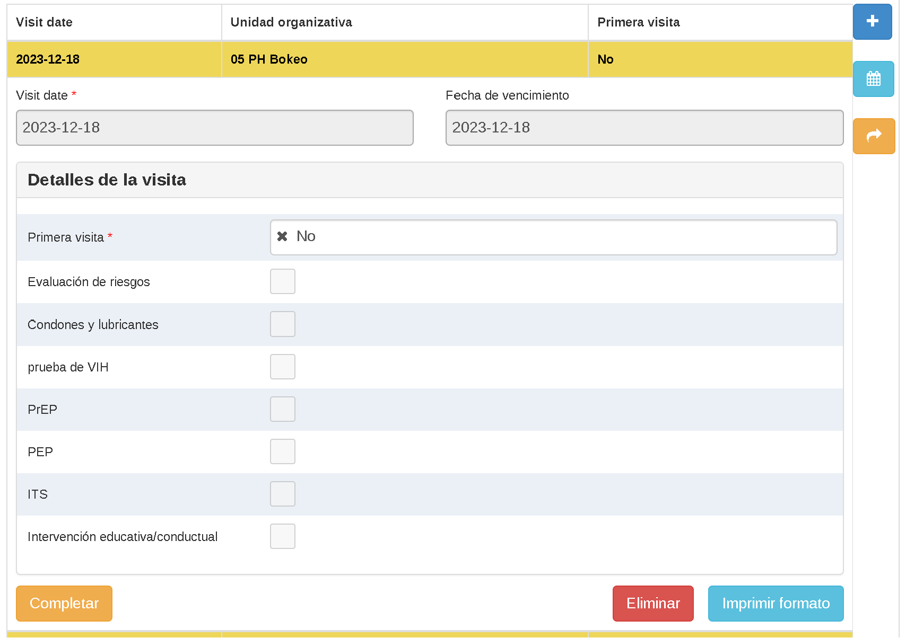

**Evaluación de Riesgo:**

En esta sección se determina el tipo de riesgo al que potencialmente estaría expuesto el individuo.

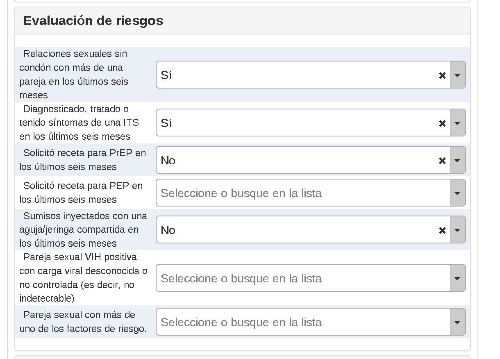

| Nombre de formulario en español | NAME | Short Name | Code | Form Name | Option Set | UID |
|----------------------------------|------|------------|------|-----------|------------|-----|
| Diagnóstico, tratamiento o síntomas de una ITS en los últimos seis meses | HIVp_PAHO - RA: Diagnosed, treated or had symptoms of an STI in the last six months | RA: Diagnosed, treated or had symptoms of an STI | HIV_PREV_PAHO_RA_STI | Diagnosed, treated or had symptoms of an STI in the last six months | TEXT | HIVp_PAHO - Yes/No/No answer | oDvki3T6yBg |
| Inyección de sustancias con una aguja/jeringa compartida en los últimos seis meses | HIVp_PAHO - RA: Injected subs with a shared needle/syringe in the last six months | RA: Injected subs with a shared needle/syringe | HIV_PREV_PAHO_RA_SHARED_NEEDLE_SYRINGE | Injected subs with a shared needle/syringe in the last six months | TEXT | HIVp_PAHO - Yes/No/No answer | LWZxHITxCh8 |
| Solicitud de receta para PEP en los últimos seis meses | HIVp_PAHO - RA: Requested a prescription for PEP in the last six months | RA: Requested a prescription for PEP | HIV_PREV_PAHO_RA_PEP | Requested a prescription for PEP in the last six months | TEXT | HIVp_PAHO - Yes/No/No answer | LGOlnBw96nA |
| Solicitud de receta para PrEP en los últimos seis meses | HIVp_PAHO - RA: Requested a prescription for PrEP in the last six months | RA: Requested a prescription for PrEP | HIV_PREV_PAHO_PI_PREP | Requested a prescription for PrEP in the last six months | TEXT | HIVp_PAHO - Yes/No/No answer | pbuFhE8ScFU |
| Pareja sexual seropositiva con carga viral desconocida o no controlada (es decir, no indetectable) | HIVp_PAHO - RA: Sex partner who is HIV-positive with unknown or uncontrolled viral load (i.e. not undetectable) | RA: Sex partner HIV-positive (no undetectable VL) | HIV_PREV_PAHO_RA_HIV_POS_PARTNER | Sex partner who is HIV-positive with unknown or uncontrolled viral load (i.e. not undetectable) | Partners of HIV-positive people with undetectable viral load should not be considered as high risk since HIV-positive people with undetectable viral load do not transmit the virus to their partners. | TEXT | HIVp_PAHO - Yes/No/No answer | AmcpSTc4miC |
| Pareja sexual con más de uno de los factores de riesgo | HIVp_PAHO - RA: Sex partner with more than one of the risk factors | RA: Sex partner more than one of the risk factors | HIV_PREV_PAHO_RA_PARTNER_MULTI_RISK | Sex partner with more than one of the risk factors | TEXT | HIVp_PAHO - Yes/No/No answer | RdB665x0qg9 |
| Sexo sin condón con más de una pareja en los últimos seis meses | HIVp_PAHO - RA: Sex without condom with more than one partner in the last six months | RA: Sex without condom with more than one partner | HIV_PREV_PAHO_RA_NO_CONDOM_PLURI_PARTNER | Sex without condom with more than one partner in the last six months | TEXT | HIVp_PAHO - Yes/No/No answer | BKOKv6jqkXb |

**Condones y lubricantes:**
Registra si condones o lubricantes fueron distribuídos durante la visita. Despliega la opcion de seleccionar la cantidad si la respuesta es “si”.

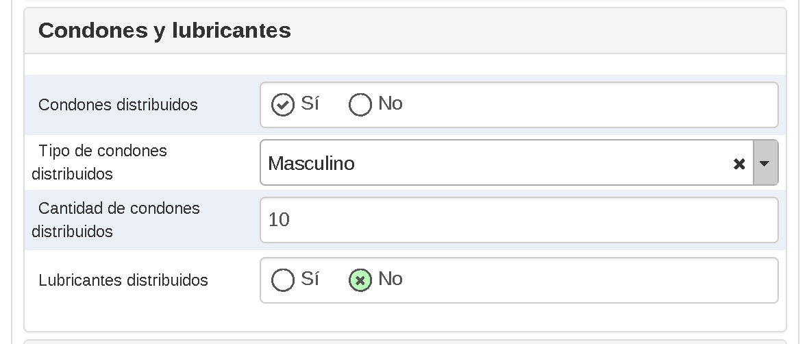

| Nombre de formato en Español | Name | UID |
|------------------------------|------|-----|
| Condones Distribuidos | HIVp_PAHO - Condoms distributed | tZ1V7bbAkPv |
| Tipo de condones distribuido | HIVp_PAHO - Type of condoms distributed | bXz3CHo6VPt |
| Cantidad de condones distribuidos | HIVp_PAHO - Ammount of condoms distributed | iWehm0yBubk |
| Lubricantes distribuidos | HIVp_PAHO - Lubricants distributed | UDyNotL2waK |
| Cantidad de lubricantes distribuidos | HIVp_PAHO - Ammount of lubricants distributed | dUrLoNS5JJE |

**Prueba de VIH:**

Registra los detalles de la última prueba de VIH realizada. Esta sección contiene elementos de dato genéricos (Prueba de VIH (A1, A2, A2) que deben configurarse según el tipo de prueba disponible en el país.

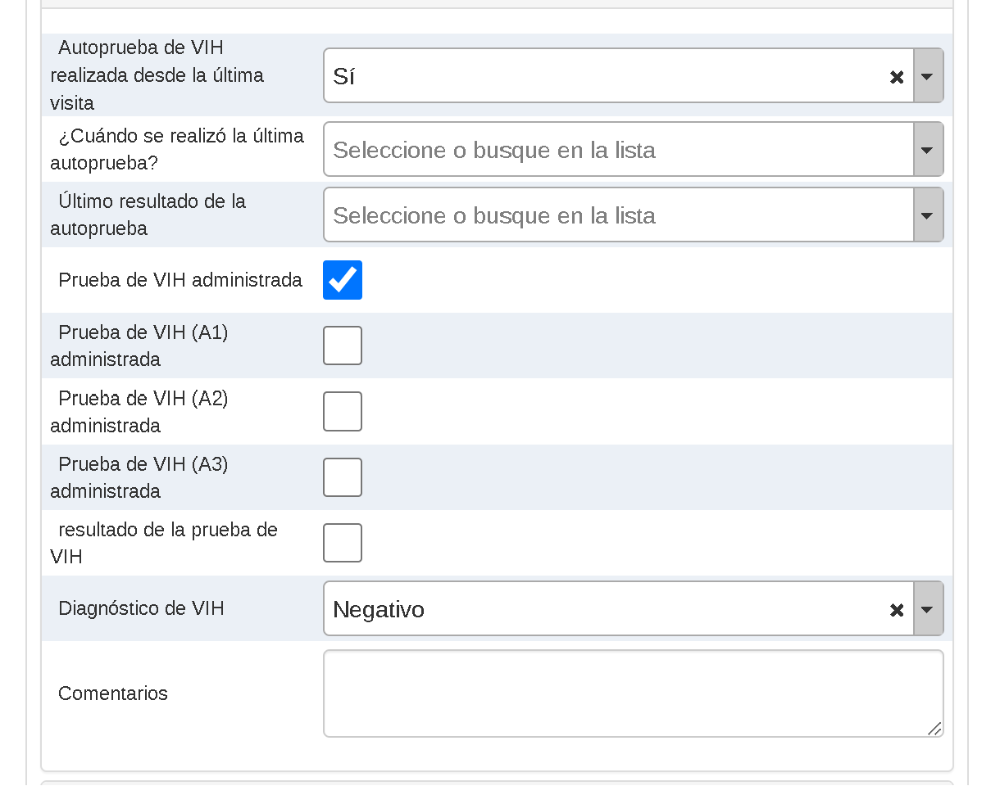

| Nombre de formulario en Español | Nombre | Nombre Corto | Codigo | Nombre de formulario | UID |
|----------------------------------|--------|--------------|--------|----------------------|-----|
| Prueba de VIH | HIVp_PAHO - HIV test | HIV test | HIV_PREV_PAHO_HIV_TEST | HIV test | yI631ZocQZf |
| Prueba de VIH administrada | HIVp_PAHO - HIV test: administered | HIV test: administered | HIV_PREV_PAHO_HIV_TEST_ADMINISTERED | HIV test administered | Uy89FCvs6Ko |
| Comentarios | HIVp_PAHO - HIV test: Comments | HIV test: Comments | HIV_PREV_PAHO_HIV_TEST_COMMENTS | Comments | Y1V9A8GpJiR |
| Diagnóstico de VIH | HIVp_PAHO - HIV test: HIV diagnosis | HIV test: HIV diagnosis | HIV_PREV_PAHO_DIAGNOSTIC_HIV | HIV diagnosis | x6jeZuctqoM |
| Auto-prueba de VIH realizada desde la última visita | HIVp_PAHO - HIV test: HIV self-test done since last visit | HIV test: HIV self-test done since last visit | HIV_PREV_PAHO_HIV_AUTOTEST_DONE | HIV self-test done since last visit | UpNgy0a6N6j |
| Auto-prueba de VIH alguna vez realizada | HIVp_PAHO - HIV test: HIV self-test ever done | HIV test: HIV self-test ever done | HIV_PREV_PAHO_SELF_TEST_EVER | HIV self-test ever done | et5nDy6QyHY |
| Prueba de VIH (A1) administrada | HIVp_PAHO - HIV test: HIV test (A1) administered | HIV test: HIV test (A1) administered | HIV_PREV_PAHO_HIV_TEST_A1_ADMINISTERED | HIV test (A1) administered | ktb9vupNQSr |
| Resultado de la prueba de VIH (A1) | HIVp_PAHO - HIV test: HIV test (A1) result | HIV test: HIV test (A1) result | HIV_PREV_PAHO_HIV_TEST_A1_RESULT | HIV test (A1) result | jWvC0hTOW02 |
| Prueba de VIH (A2) administrada | HIVp_PAHO - HIV test: HIV test (A2) administered | HIV test: HIV test (A2) administered | HIV_PREV_PAHO_HIV_TEST_A2_ADMINISTERED | HIV test (A2) administered | dB1PmlvfxXk |
| Resultado de la prueba de VIH (A2) | HIVp_PAHO - HIV test: HIV test (A2) result | HIV test: HIV test (A2) result | HIV_PREV_PAHO_HIV_TEST_A2_RESULT | HIV test (A2) result | A2ulG8Vg1mt |
| Prueba de VIH (A3) administrada | HIVp_PAHO - HIV test: HIV test (A3) administered | HIV test: HIV test (A3) administered | HIV_PREV_PAHO_HIV_TEST_A3_ADMINISTERED | HIV test (A3) administered | NSL3UEtFktr |
| Resultado de la prueba de VIH (A3) | HIVp_PAHO - HIV test: HIV test (A3) result | HIV test: HIV test (A3) result | HIV_PREV_PAHO_HIV_TEST_A3_RESULT | HIV test (A3) result | Z92PDz4uIeL |
| Resultado de la última auto-prueba | HIVp_PAHO - HIV test: Last self-test result | HIV test: Last self-test result | HIV_PREV_PAHO_HIV_AUTOTEST_RESULT | Last self-test result | om3jqon8nGL |
| Modo de provisión de la prueba | HIVp_PAHO - HIV test: Mode of test provision | HIV test: Mode of test provision | HIV_PREV_PAHO_HIV_TEST_PROVISION | Mode of test provision | Y7Vjp8sip8b |
| Resultado de la prueba de VIH | HIVp_PAHO - HIV test: result | HIV test: result | HIV_PREV_PAHO_HIV_TEST_RESULT | HIV test result | nWAGHq3v2XP |
| Especificar otro modo de provisión de la prueba | HIVp_PAHO - HIV test: Specify other mode of test provision | HIV test: Specify other mode of test provision | HIV_PREV_PAHO_HIV_TEST_PROVISION_OTHER | Specify other mode of test provision | wPIN6bTE2D9 |
| ¿Cuándo se realizó la última auto-prueba? | HIVp_PAHO - HIV test: When was the last self-test done? | HIV test: When was the last self-test done? | HIV_PREV_PAHO_HIV_AUTOTEST_MONTHS_TEST | When was the last self-test done? | BTTMxs6AMGI |
| ¿Este establecimiento ofrece servicios de pruebas de VIH? | HIVp_PAHO - HIV testing service available | HIV testing service available | HIV_PREV_PAHO_HFP_HIV_TEST_AVAILABLE | Does this facility offer HIV testing services? | A5niMbKKYbS |

**PrEP:**

Información relacionada a la profilaxis pre exposición (PrEP), si se le ha entregado al cliente y si el cliente ha experimentado efectos adversos. Los efectos adversos están configurados con opciones genéricas (CONFIG_1, CONFIG_2, etc) y se deberán modificar acorde a las necesidades locales.

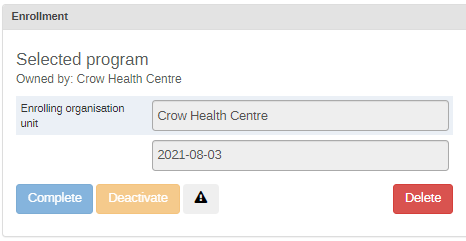

| Nombre de formulario en Español | Nombre | Nombre Corto | Codigo | Nombre de formulario | UID |
|---------------------------------|--------|--------------|--------|----------------------|-----|
| Trabajadoras sexuales femeninas | HIVp_PAHO - Pop estimation - PrEP eligible: Female sex workers | HIVp_PAHO - Pop estimation - PrEP eligible: FSW | HIV_PREV_PAHO_KPE_PREP_ELIGIBLE_SW | Female sex workers | jL8uUKNmT0M |
| HSH (Hombres que tienen Sexo con Hombres) | HIVp_PAHO - Pop estimation - PrEP eligible: MSM | HIVp_PAHO - Pop estimation - PrEP eligible: MSM | HIV_PREV_PAHO_KPE_PREP_ELIGIBLE_MSM | MSM | oUb8ga6vRJ4 |
| Mujeres transgénero | HIVp_PAHO - Pop estimation - PrEP eligible: Transgender women | HIVp_PAHO - Pop estimation - PrEP eligible: TGW | HIV_PREV_PAHO_KPE_PREP_ELIGIBLE_TGW | Transgedner women | Kq4cNZ6GNAy |
| PrEP (Profilaxis Pre-Exposición) | HIVp_PAHO - PrEP | PrEP | HIV_PREV_PAHO_PREP_VISIT | PrEP | P1RfSZzzSEB |
| ¿Ofrece este establecimiento servicios de PrEP? | HIVp_PAHO - PrEP service available | PrEP service available | HIV_PREV_PAHO_HFP_PREP_SERVICE_AVAILABLE | Does this facility offer PrEP services? | dWTjS1G9jbn |
| Efecto adverso experimentado | HIVp_PAHO - PrEP: Adverse effect experienced | PrEP: adverse effect | HIV_PREV_PAHO_PREP_ADVERSE_EFFECT_EXPERIENCED | Adverse effect experienced | DPHeJgisI0u |
| Comentarios | HIVp_PAHO - PrEP: Comments | PrEP: Comments | HIV_PREV_PAHO_PREP_COMMENTS | Comments | C0W8EEMUTfi |
| Actualmente bajo PrEP | HIVp_PAHO - PrEP: Currently under PrEP | PrEP: Currently under PrEP | HIV_PREV_PAHO_PREP_ON_PREP | Currently under PrEP | jOtLAW0QLKh |
| Experiencia con PrEP | HIVp_PAHO - PrEP: Experience with PrEP | PrEP: Experience with PrEP | HIV_PREV_PAHO_PREP_EXPERIENCE | Experience with PrEP | KLIPeOJ4gQx |
| Formulación de PrEP administrada | HIVp_PAHO - PrEP: Formulation of PrEP delivered | PrEP: Formulation | HIV_PREV_PAHO_PREP_FORMULATION | Formulation of PrEP delivered | Sk5xiKRZF9P |
| Posología | HIVp_PAHO - PrEP: Posology | PrEP: Posology | HIV_PREV_PAHO_PREP_DOSAGE | Posology | GExKSajen7T |
| ¿La persona acepta PrEP? | HIVp_PAHO - PrEP: PrEP accepted | PrEP: Accepted | HIV_PREV_PAHO_PREP_ACCEPTED | Does the person accept PrEP? | n5xYJmCTQfd |
| PrEP entregada/administrada | HIVp_PAHO - PrEP: PrEP delivered/administered | PrEP: PrEP delivered/administered | HIV_PREV_PAHO_PREP_DELIVERED_ADMINISTERED | PrEP delivered/administered | OmZkGo1gbRe |
| Cantidad entregada | HIVp_PAHO - PrEP: Quantity delivered | PrEP: Quantity delivered | HIV_PREV_PAHO_PREP_QUANTITY | Quantity delivered | VPwI1rLi0qF |
| Razón para la discontinuación/interrupción | HIVp_PAHO - PrEP: Reason for discontinuation/interruption | PrEP: Reason for discontinuation/interruption | HIV_PREV_PAHO_PREP_REASON_DISCONTINUATION | Reason for discontinuation/interruption | miqWcoHGmHr |
| Especificar efecto adverso | HIVp_PAHO - PrEP: Specify adverse effect | PrEP: Specify adverse effect PREP | HIV_PREV_PAHO_PREP_ADVERSE_EFFECT | Specify adverse effect | aipA7rEraPQ |
| Especificar otro | HIVp_PAHO - PrEP: Specify other adverse effect | PrEP: Specify other adverse effect | HIV_PREV_PAHO_PREP_ADVERSE_EFFECT_OTHER | Specify other | SYffAqPGAsr |
| Especificar otro | HIVp_PAHO - PrEP:

**PEP:**

*Información relacionada al profiláctico pos-exposición (PEP)*

En esta sección se registra si la persona recibió el profiláctico postexposición, y las circunstancias de la administración

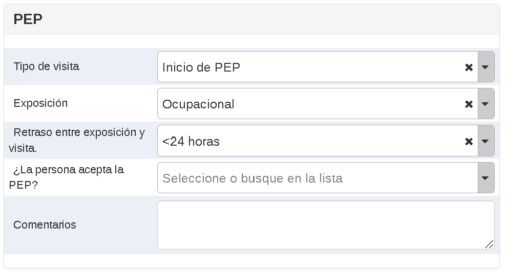

| Nombre de formulario en Español | Nombre | Nombre Corto | Codigo | Nombre de formulario | UID |
|----------------------------------|--------|--------------|--------|----------------------|-----|
| PEP (Profilaxis Post-Exposición) | HIVp_PAHO - PEP | PEP | HIV_PREV_PAHO_PEP_VISIT | PEP | sU70bInkUno |
| ¿Ofrece este establecimiento servicios de PEP? | HIVp_PAHO - PEP service available | PEP service available | HIV_PREV_PAHO_HFP_PEP_SERVICE_AVAILABLE | Does this facility offer PEP services? | BMbr3ODJdJd |
| Comentarios | HIVp_PAHO - PEP: Comments | PEP: Comments | HIV_PREV_PAHO_PEP_COMMENTS | Comments | rOEsMvFfkc5 |
| Retraso entre la exposición y la visita | HIVp_PAHO - PEP: Delay between exposition and visit | PEP: Delay between exposition and visit | HIV_PREV_PAHO_PEP_DELAY_AFTER_EXPOSITION | Delay between exposition and visit | EZY5qAkPaUK |
| Exposición | HIVp_PAHO - PEP: Exposure | PEP: Exposure | HIV_PREV_PAHO_PEP_EXPOSURE | Exposure | Tm3IdU6qHRD |
| Resultado del control de la prueba de VIH | HIVp_PAHO - PEP: HIV test control result | PEP: HIV test control result | HIV_PREV_PAHO_PEP_HIV_TEST_CONTROL_RESULT | HIV test control result | wnXl8BHhwbF |
| Naturaleza no ocupacional | HIVp_PAHO - PEP: Non-occupational nature | PEP: Non-occupational nature | HIV_PREV_PAHO_PEP_NON_OCCUPATIONAL_NATURE | Non-occupational nature | TgX2dztWmim |
| ¿La persona acepta PEP? | HIVp_PAHO - PEP: PEP accepted | PEP: Accepted | HIV_PREV_PAHO_PEP_ACCEPTED | Does the person accept PEP? | r3XNaIvfGoG |
| El curso de profilaxis ha sido tomado correctamente y completamente | HIVp_PAHO - PEP: Prophilaxis course has been correctly and completely taken | PEP: prophilaxis correctly taken | HIV_PREV_PAHO_PEP_COMPLETE | Prophilaxis course has been correctly and completely taken | rEbPnmHYszx |
| Tipo de visita | HIVp_PAHO - PEP: Type of visit | PEP: Type of visit | HIV_PREV_PAHO_PEP_TYPE_VISIT | Type of visit | U5dugYmQmWz |

**ITS:**

*Información relacionada a enfermedades de transmisión sexual (ITSs)*

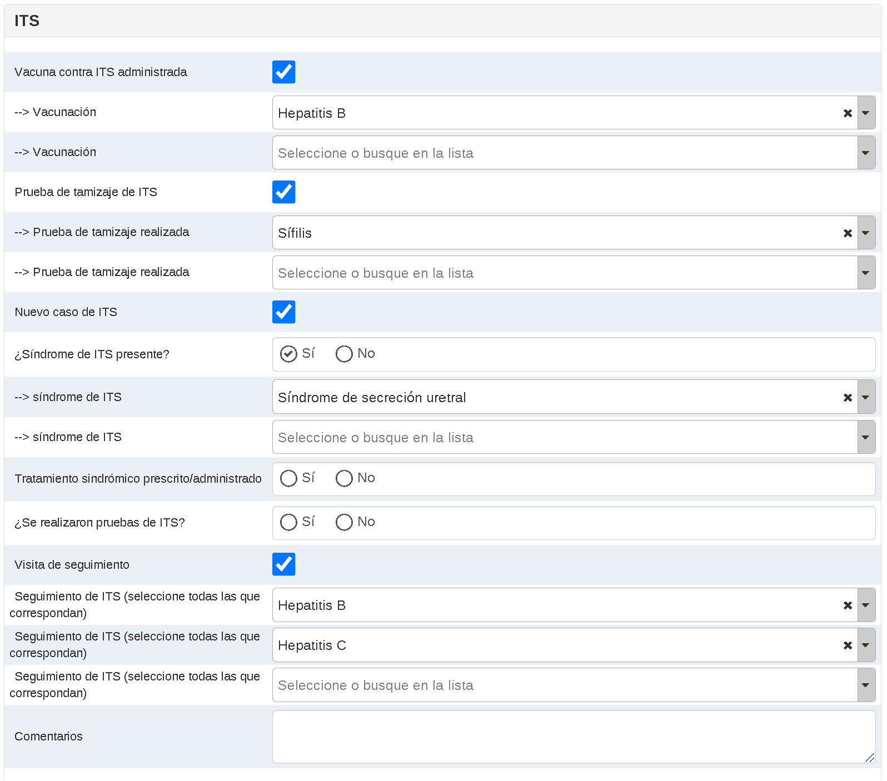

En esta sección se seleccionan varios procesos relacionados con las ITS, con lógica de ocultar y mostrar elementos según la necesidad del flujo de entrada de datos. En primera instancia:

Vacunación (si una vacuna es aplicada, y contra cual ITS)
Pruebas de Tamizaje (que prueba es realizada)
Si existe un nuevo caso de ITS
Que síndrome está presente
Si se realizaron pruebas adicionales de ITS, y cuales
Si se realizaron visitas de seguimiento

En caso de que se hubiesen presentado ITSs, se despliegan las siguientes secciones adicionales:

ITS: Sífilis
ITS Neisseria Gonorrhoeae
ITS: Clamidia
ITS: Hepatitis B
ITS: Hepatitis C
ITS: Viruela del Simio

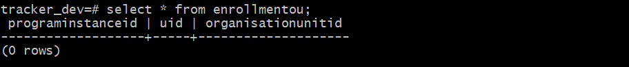

| Nombre de formulario en español                      | NAME                                                                           | Short Name                                         | Code                                              | Form Name                                   |   | UID         |
|------------------------------------------------------|--------------------------------------------------------------------------------|----------------------------------------------------|---------------------------------------------------|---------------------------------------------|---|-------------|
| ITS (Infecciones de Transmisión Sexual)              | HIVp_PAHO - STI                                                                | STI                                                | HIV_PREV_PAHO_STI_VISIT                           | STI                                         |   | slWgW2buut4 |
| Comentarios                                          | HIVp_PAHO - STI - Chlamydia: Comments                                          | STI - Chlamydia: Comments                          | HIV_PREV_PAHO_STI_CHLAMYDIA_COMMENTS              | Comments                                    |   | FavkUwJJ6Bm |
| Resultado de la prueba                               | HIVp_PAHO - STI - Chlamydia: Test result                                       | STI - Chlamydia: Test result                       | HIV_PREV_PAHO_STI_CHLAMYDIA_TEST_RESULT           | Test result                                 |   | KcT9QCXSO9y |
| Tratamiento prescrito/administrado                   | HIVp_PAHO - STI - Chlamydia: Treatment prescribed/administered                 | STI - Chlamydia: Treatment prescribed/administered | HIV_PREV_PAHO_STI_CHLAMYDIA_TREATMENT             | Treatment prescribed/administered           |   | s3Our0bwxsQ |
| --> Tratamiento prescrito/administrado               | HIVp_PAHO - STI - Chlamydia: Treatment prescribed/administered - 1             | STI - Chlamydia: Treatment prescribed/adm - 1      | HIV_PREV_PAHO_STI_CHLAMYDIA_TREATMENT_1           | --> Treatment prescribed/administered       |   | qWCPmy91bSU |
| --> Tratamiento prescrito/administrado               | HIVp_PAHO - STI - Chlamydia: Treatment prescribed/administered - 2             | STI - Chlamydia: Treatment prescribed/adm - 2      | HIV_PREV_PAHO_STI_CHLAMYDIA_TREATMENT_2           | --> Treatment prescribed/administered       |   | F2IciGwntp3 |
| --> Tratamiento prescrito/administrado               | HIVp_PAHO - STI - Chlamydia: Treatment prescribed/administered - 3             | STI - Chlamydia: Treatment prescribed/adm - 3      | HIV_PREV_PAHO_STI_CHLAMYDIA_TREATMENT_3           | --> Treatment prescribed/administered       |   | TthZZAVmEOm |
| --> Tratamiento prescrito/administrado               | HIVp_PAHO - STI - Chlamydia: Treatment prescribed/administered - 4             | STI - Chlamydia: Treatment prescribed/adm - 4      | HIV_PREV_PAHO_STI_CHLAMYDIA_TREATMENT_4           | --> Treatment prescribed/administered       |   | I2OZPiZhKKX |
| Comentarios                                          | HIVp_PAHO - STI - Gonorrhoeae: Comments                                        | STI - Gonorrhoeae: Comments                        | HIV_PREV_PAHO_STI_GONORRHOEA_COMMENTS             | Comments                                    |   | LqEBl5agliO |
| Comentarios                                          | HIVp_PAHO - STI - Hepatitis B: Comments                                        | STI - Hepatitis B: Comments                        | HIV_PREV_PAHO_STI_HEPATITIS_B_COMMENTS            | Comments                                    |   | qxw7TIvmUmd |
| Derivado para tratamiento                            | HIVp_PAHO - STI - Hepatitis B: Referred for treatment                          | STI - Hepatitis B: Referred for treatment          | HIV_PREV_PAHO_STI_HEPATITIS_B_REFERRED_TREATMENT  | Referred for treatment                      |   | ZPDAWVvEbm6 |
| Resultado de la prueba                               | HIVp_PAHO - STI - Hepatitis B: Test result                                     | STI - Hepatitis B: Test result                     | HIV_PREV_PAHO_STI_HEPATITIS_B_TEST_RESULT         | Test result                                 |   | iXXQTteyDEK |
| Comentarios                                          | HIVp_PAHO - STI - Hepatitis C: Comments                                        | STI - Hepatitis C: Comments                        | HIV_PREV_PAHO_STI_HEPATITIS_C_COMMENTS            | Comments                                    |   | r4Fk5se7snc |
| Derivado para tratamiento                            | HIVp_PAHO - STI - Hepatitis C: Referred for treatment                          | STI - Hepatitis C: Referred for treatment          | HIV_PREV_PAHO_STI_HEPATITIS_C_REFERRED_TREATMENT  | Referred for treatment                      |   | H1BPdJ6C6UA |
| Resultado de la prueba                               | HIVp_PAHO - STI - Hepatitis C: Test result                                     | STI - Hepatitis C: Test result                     | HIV_PREV_PAHO_STI_HEPATITIS_C_TEST_RESULT         | Test result                                 |   | NiomOHureo2 |
| Comentarios                                          | HIVp_PAHO - STI - Monkeypox: Comments                                          | STI - Monkeypox: Comments                          | HIV_PREV_PAHO_STI_MONKEYPOX_COMMENTS              | Comments                                    |   | e4qJo7eHBJO |
| Resultado de la prueba                               | HIVp_PAHO - STI - Monkeypox: Test result                                       | STI - Monkeypox: Test result                       | HIV_PREV_PAHO_STI_MONKEYPOX_TEST                  | Test result                                 |   | UkUlLKydCH6 |
| Tratamiento prescrito/administrado                   | HIVp_PAHO - STI - Monkeypox: Treatment                                         | STI - Monkeypox: Treatment                         | HIV_PREV_PAHO_STI_MONKEYPOX_TREATMENT             | Treatment prescribed/administered           |   | oDlFP1BuOc4 |
| --> Tratamiento prescrito/administrado               | HIVp_PAHO - STI - Monkeypox: Treatment - 1                                     | STI - Monkeypox: Treatment - 1                     | HIV_PREV_PAHO_STI_MONKEYPOX_TREATMENT_1           | --> Treatment prescribed/administered       |   | G6ZY8hrRsgw |
| --> Tratamiento prescrito/administrado               | HIVp_PAHO - STI - Monkeypox: Treatment - 2                                     | STI - Monkeypox: Treatment - 2                     | HIV_PREV_PAHO_STI_MONKEYPOX_TREATMENT_2           | --> Treatment prescribed/administered       |   | ZVvxLCx7aEh |
| --> Tratamiento prescrito/administrado               | HIVp_PAHO - STI - Monkeypox: Treatment - 3                                     | STI - Monkeypox: Treatment - 3                     | HIV_PREV_PAHO_STI_MONKEYPOX_TREATMENT_3           | --> Treatment prescribed/administered       |   | Qw3yQ7I2WXE |
| --> Tratamiento prescrito/administrado               | HIVp_PAHO - STI - Monkeypox: Treatment - 4                                     | STI - Monkeypox: Treatment - 4                     | HIV_PREV_PAHO_STI_MONKEYPOX_TREATMENT_4           | --> Treatment prescribed/administered       |   | Ej9icMHjSDR |
| Resultado de la prueba                               | HIVp_PAHO - STI - Neisseria gonorrhoeae: Test result                           | STI - Neisseria gonorrhoeae: Test result           | HIV_PREV_PAHO_STI_GONORRHOEA_TEST_RESULT          | Test result                                 |   | aOe6Z4EyuGB |
| Tratamiento prescrito/administrado                   | HIVp_PAHO - STI - Neisseria gonorrhoeae: Treatment prescribed/administered     | STI - Gonorrhoeae: Treatment prescribed/adm        | HIV_PREV_PAHO_STI_GONORRHOEA_TREATMENT            | Treatment prescribed/administered           |   | FHIDBvgWCDO |
| --> Tratamiento prescrito/administrado               | HIVp_PAHO - STI - Neisseria gonorrhoeae: Treatment prescribed/administered - 1 | STI - Gonorrhoeae: Treatment prescribed/adm 1      | HIV_PREV_PAHO_STI_GONORRHOEA_TREATMENT_1          | --> Treatment prescribed/administered       |   | oa0132mVdY6 |
| --> Tratamiento prescrito/administrado               | HIVp_PAHO - STI - Neisseria gonorrhoeae: Treatment prescribed/administered - 2 | STI - Gonorrhoeae: Treatment prescribed/adm 2      | HIV_PREV_PAHO_STI_GONORRHOEA_TREATMENT_2          | --> Treatment prescribed/administered       |   | Vl4HyTCpgAi |
| --> Tratamiento prescrito/administrado               | HIVp_PAHO - STI - Neisseria gonorrhoeae: Treatment prescribed/administered - 3 | STI - Gonorrhoeae: Treatment prescribed/adm 3      | HIV_PREV_PAHO_STI_GONORRHOEA_TREATMENT_3          | --> Treatment prescribed/administered       |   | XrtzlQXaPAB |
| --> Tratamiento prescrito/administrado               | HIVp_PAHO - STI - Neisseria gonorrhoeae: Treatment prescribed/administered - 4 | STI - Gonorrhoeae: Treatment prescribed/adm 4      | HIV_PREV_PAHO_STI_GONORRHOEA_TREATMENT_4          | --> Treatment prescribed/administered       |   | I6AYBFHqxCo |
| Comentarios                                          | HIVp_PAHO - STI - Syphilis: comments                                           | STI - Syphilis: comments                           | HIV_PREV_PAHO_STI_SYPHILIS_COMMENTS               | Comments                                    |   | V6Re5RYtw2X |
| Diluciones                                           | HIVp_PAHO - STI - Syphilis: Dilutions of non-treponemal test                   | STI - Syphilis: Dilutions of non-treponemal test   | HIV_PREV_PAHO_STI_SYPHILIS_TEST_NT_DILUTIONS      | Dilutions                                   |   | U9sldJv0Fq0 |
| Prueba no treponémica                                | HIVp_PAHO - STI - Syphilis: non-treponemal test                                | STI - Syphilis: non-treponemal test                | HIV_PREV_PAHO_STI_SYPHILIS_TEST_NON_TREPONEMAL    | Non-treponemal test                         |   | zflsVUZ3Wnl |
| Resultado de la prueba no treponémica                | HIVp_PAHO - STI - Syphilis: non-treponemal test result                         | STI - Syphilis: non-treponemal test result         | HIV_PREV_PAHO_STI_SYPHILIS_TEST_NTL_RESULT        | Non-treponemal test result                  |   | gF5QQZSEqWP |
| Tratamiento prescrito/administrado                   | HIVp_PAHO - STI - Syphilis: treatment prescribed/administered                  | STI - Syphilis: treatment prescribed/administered  | HIV_PREV_PAHO_STI_SYPHILIS_TREATMENT              | Treatment prescribed/administered           |   | y3OKXo6t8ss |
| --> Tratamiento prescrito/administrado               | HIVp_PAHO - STI - Syphilis: treatment prescribed/administered - 1              | STI - Syphilis: treatment prescribed/adm - 1       | HIV_PREV_PAHO_STI_SYPHILIS_TREATMENT_1            | --> Treatment prescribed/administered       |   | Butv12EXSpS |
| --> Tratamiento prescrito/administrado               | HIVp_PAHO - STI - Syphilis: treatment prescribed/administered - 2              | STI - Syphilis: treatment prescribed/adm - 2       | HIV_PREV_PAHO_STI_SYPHILIS_TREATMENT_2            | --> Treatment prescribed/administered       |   | lq7jbZT1KFu |
| --> Tratamiento prescrito/administrado               | HIVp_PAHO - STI - Syphilis: treatment prescribed/administered - 3              | STI - Syphilis: treatment prescribed/adm - 3       | HIV_PREV_PAHO_STI_SYPHILIS_TREATMENT_3            | --> Treatment prescribed/administered       |   | zEBQWPi4DWN |
| --> Tratamiento prescrito/administrado               | HIVp_PAHO - STI - Syphilis: treatment prescribed/administered - 4              | STI - Syphilis: treatment prescribed/adm - 4       | HIV_PREV_PAHO_STI_SYPHILIS_TREATMENT_4            | --> Treatment prescribed/administered       |   | WijYFcqao5M |
| Prueba treponémica                                   | HIVp_PAHO - STI - Syphilis: treponemal test                                    | STI - Syphilis: treponemal test                    | HIV_PREV_PAHO_STI_SYPHILIS_TEST_TREPONEMAL        | Treponemal test                             |   | gC5uQMsjOaR |
| Resultado de la prueba treponémica                   | HIVp_PAHO - STI - Syphilis: treponemal test result                             | STI - Syphilis: treponemal test result             | HIV_PREV_PAHO_STI_SYPHILIS_TEST_TREPONEMAL_RESULT | Treponemal test result                      |   | YhyOhEHG8OI |
| Seguimiento de ITS (seleccionar todo lo que aplique) | HIVp_PAHO - STI FU - 1                                                         | STI FU - 1                                         | HIV_PREV_PAHO_STI_FU_1                            | Follow-up STI (select all that apply)       |   | rsk0ydALkH2 |
| Seguimiento de ITS (seleccionar todo lo que aplique) | HIVp_PAHO - STI FU - 2                                                         | STI FU - 2                                         | HIV_PREV_PAHO_STI_FU_2                            | Follow-up STI (select all that apply)       |   | AoWknOm1J9J |
| Seguimiento de ITS (seleccionar todo lo que aplique) | HIVp_PAHO - STI FU - 3                                                         | STI FU - 3                                         | HIV_PREV_PAHO_STI_FU_3                            | Follow-up STI (select all that apply)       |   | rd3NftJYdlW |
| Seguimiento de ITS (seleccionar todo lo que aplique) | HIVp_PAHO - STI FU - 4                                                         | STI FU - 4                                         | HIV_PREV_PAHO_STI_FU_4                            | Follow-up STI (select all that apply)       |   | qsxpedcFaCm |
| Seguimiento de ITS (seleccionar todo lo que aplique) | HIVp_PAHO - STI FU - 5                                                         | STI FU - 5                                         | HIV_PREV_PAHO_STI_FU_5                            | Follow-up STI (select all that apply)       |   | yyqEjNEbuYV |
| Seguimiento de ITS (seleccionar todo lo que aplique) | HIVp_PAHO - STI FU - 6                                                         | STI FU - 6                                         | HIV_PREV_PAHO_STI_FU_6                            | Follow-up STI (select all that apply)       |   | aIkHX8VePBw |
| ¿Ofrece este establecimiento servicios de ITS?       | HIVp_PAHO - STI service available                                              | STI service available                              | HIV_PREV_PAHO_HFP_STI_SERVICE_AVAILABLE           | Does this facility offer STI services?      |   | JNsa6hkUUS5 |
| --> Síndrome de ITS                                  | HIVp_PAHO - STI syndrome - 1                                                   | STI syndrome - 1                                   | HIV_PREV_PAHO_STI_SYNDROME_1                      | --> STI syndrome                            |   | HSzzcPJpA6I |
| --> Síndrome de ITS                                  | HIVp_PAHO - STI syndrome - 2                                                   | STI syndrome - 2                                   | HIV_PREV_PAHO_STI_SYNDROME_2                      | --> STI syndrome                            |   | D4IIo7OwOXb |
| --> Síndrome de ITS                                  | HIVp_PAHO - STI syndrome - 3                                                   | STI syndrome - 3                                   | HIV_PREV_PAHO_STI_SYNDROME_3                      | --> STI syndrome                            |   | c1e15eg6ddB |
| --> Síndrome de ITS                                  | HIVp_PAHO - STI syndrome - 4                                                   | STI syndrome - 4                                   | HIV_PREV_PAHO_STI_SYNDROME_4                      | --> STI syndrome                            |   | BE7dAhKw3bl |
| Especificar otro                                     | HIVp_PAHO - STI syndrome - Other                                               | STI syndrome - Other                               | HIV_PREV_PAHO_STI_SYNDROME_OTHER                  | Specify other                               |   | Yd47DaOfE5C |
| Vacuna de ITS administrada                           | HIVp_PAHO - STI: Administered STI vaccine                                      | STI: Administered STI vaccine                      | HIV_PREV_PAHO_STI_VACCINATION                     | Administered STI vaccine                    |   | d1X6QPt5U2c |
| Comentarios                                          | HIVp_PAHO - STI: Comments                                                      | STI: Comments                                      | HIV_PREV_PAHO_STI_COMMENTS                        | Comments                                    |   | zuRlKXZcGOe |
| Visita de seguimiento                                | HIVp_PAHO - STI: Follow-up visit                                               | STI: Follow-up visit                               | HIV_PREV_PAHO_STI_FU_VISIT                        | Follow-up visit                             |   | DQ0CJAHkgQp |
| Nuevo caso de ITS                                    | HIVp_PAHO - STI: New case                                                      | STI: New case                                      | HIV_PREV_PAHO_STI_NEW_CASE                        | New STI case                                |   | bD48X6EoseN |
| Prueba de detección de ITS                           | HIVp_PAHO - STI: Screening test                                                | STI: Screening test                                | HIV_PREV_PAHO_STI_SCREENING_TEST                  | STI screening test                          |   | kZilwp1ttqy |
| --> Prueba de tamizaje administrada                  | HIVp_PAHO - STI: Screening test - 1                                            | STI: Screening test - 1                            | HIV_PREV_PAHO_STI_SCREENING_TEST_1                | --> Screening test administered             |   | UHLaYwNrDuY |
| --> Prueba de tamizaje administrada                  | HIVp_PAHO - STI: Screening test - 2                                            | STI: Screening test - 2                            | HIV_PREV_PAHO_STI_SCREENING_TEST_2                | --> Screening test administered             |   | WJmqpTHS1A8 |
| --> Prueba de tamizaje administrada                  | HIVp_PAHO - STI: Screening test - 3                                            | STI: Screening test - 3                            | HIV_PREV_PAHO_STI_SCREENING_TEST_3                | --> Screening test administered             |   | iIK3XYpG4FA |
| --> Prueba de tamizaje administrada                  | HIVp_PAHO - STI: Screening test - 4                                            | STI: Screening test - 4                            | HIV_PREV_PAHO_STI_SCREENING_TEST_4                | --> Screening test administered             |   | IdfsqcgSnJc |
| --> Prueba de tamizaje administrada                  | HIVp_PAHO - STI: Screening test - 5                                            | STI: Screening test - 5                            | HIV_PREV_PAHO_STI_SCREENING_TEST_5                | --> Screening test administered             |   | rWNj0s4gJTt |
| --> Prueba de tamizaje administrada                  | HIVp_PAHO - STI: Screening test - 6                                            | STI: Screening test - 6                            | HIV_PREV_PAHO_STI_SCREENING_TEST_6                | --> Screening test administered             |   | WKCVhnzec4Y |
| ¿Presenta síndrome de ITS?                           | HIVp_PAHO - STI: syndrome                                                      | STI: syndrome                                      | HIV_PREV_PAHO_STI_SYNDROME                        | STI syndrome present?                       |   | hptzTpwgwgo |
| Tratamiento sindrómico prescrito/administrado        | HIVp_PAHO - STI: Syndromic treatment administered                              | STI: Syndromic treatment administered              | HIV_PREV_PAHO_STI_SYNDROMIC_TREATMENT             | Syndromic treatment prescribed/administered |   | SbkBABEY4P0 |
| Tratamiento sindrómico prescrito/administrado        | HIVp_PAHO - STI: Syndromic treatment administered - 1                          | STI: Syndromic treatment administered - 1          | HIV_PREV_PAHO_STI_SYNDROMIC_TREATMENT_1           | --> Treatment prescribed/administered       |   | lxOTDDdTzq8 |
| Tratamiento sindrómico prescrito/administrado        | HIVp_PAHO - STI: Syndromic treatment administered - 2                          | STI: Syndromic treatment administered - 2          | HIV_PREV_PAHO_STI_SYNDROMIC_TREATMENT_2           | --> Treatment prescribed/administered       |   | l8vaikULkdq |
| Tratamiento sindrómico prescrito/administrado        | HIVp_PAHO - STI: Syndromic treatment administered - 3                          | STI: Syndromic treatment administered - 3          | HIV_PREV_PAHO_STI_SYNDROMIC_TREATMENT_3           | --> Treatment prescribed/administered       |   | jAqSC21RNUv |
| Tratamiento sindrómico prescrito/administrado        | HIVp_PAHO - STI: Syndromic treatment administered - 4                          | STI: Syndromic treatment administered - 4          | HIV_PREV_PAHO_STI_SYNDROMIC_TREATMENT_4           | --> Treatment prescribed/administered       |   | oIq5yxzaco1 |
| ¿Se realizó la prueba de ITS?                        | HIVp_PAHO - STI: tested                                                        | STI: tested                                        | HIV_PREV_PAHO_STI_TESTED                          | STI tested?                                 |   | PxMOypHvQyH |
| ¿Se realizó la prueba de ITS?                        | HIVp_PAHO - STI: tested - 1                                                    | STI: tested - 1                                    | HIV_PREV_PAHO_STI_TESTED_1                        | --> STI tested                              |   | P2JiWjkvXj3 |
| ¿Se realizó la prueba de ITS?                        | HIVp_PAHO - STI: tested - 2                                                    | STI: tested - 2                                    | HIV_PREV_PAHO_STI_TESTED_2                        | --> STI tested                              |   | TvNfc9vMIlR |
| ¿Se realizó la prueba de ITS?                        | HIVp_PAHO - STI: tested - 3                                                    | STI: tested - 3                                    | HIV_PREV_PAHO_STI_TESTED_3                        | --> STI tested                              |   | VdxJrdw2Kak |
| ¿Se realizó la prueba de ITS?                        | HIVp_PAHO - STI: tested - 4                                                    | STI: tested - 4                                    | HIV_PREV_PAHO_STI_TESTED_4                        | --> STI tested                              |   | OhdzJeoiZzP |
| ¿Se realizó la prueba de ITS?                        | HIVp_PAHO - STI: tested - 5                                                    | STI: tested - 5                                    | HIV_PREV_PAHO_STI_TESTED_5                        | --> STI tested                              |   | l2VrXweVVfb |
| ¿Se realizó la prueba de ITS?                        | HIVp_PAHO - STI: tested - 6                                                    | STI: tested - 6                                    | HIV_PREV_PAHO_STI_TESTED_6                        | --> STI tested                              |   | rJ9yLvQwnhY |
| --> Vacunación                                       | HIVp_PAHO - STI: Vaccination - 1                                               | STI: Vaccination - 1                               | HIV_PREV_PAHO_STI_VACCINATION_1                   | --> Vaccination                             |   | F5PKoCYCBgx |
| --> Vacunación                                       | HIVp_PAHO - STI: Vaccination - 2                                               | STI: Vaccination - 2                               | HIV_PREV_PAHO_STI_VACCINATION_2                   | --> Vaccination                             |   | qaf50DbSsfK |
| --> Vacunación                                       | HIVp_PAHO - STI: Vaccination - 3                                               | STI: Vaccination - 3                               | HIV_PREV_PAHO_STI_VACCINATION_3                   | --> Vaccination                             |   | SicHAH9p1TR |

### Grupos de elementos de datos

Todos los elementos de datos utilizados llevan el prefijo HIVp y están incluídos en el grupo HIV prevention - Service provision

## Reglas de Validación / Reglas del Programa

  Se han configurado un set básico de reglas de negocio. La mayoría de las reglas son simplemente para ocultar o mostrar secciones en la etapa de visita, pero especial cuidado debe tomarse al modificar las reglas de la etapa de selección de población clave ya que estas corresponden a una algoritmo para determinar la población clave de un usuario. When more than one option can be selected, rules are in place to ensure that the same option is not selected more than once.

| id          | name                                                                                                                | description                                                                                              |   |   |
|-------------|---------------------------------------------------------------------------------------------------------------------|----------------------------------------------------------------------------------------------------------|---|---|
| u29CxPoEEtf | HIV_PREV - Show risk assessment section details if selected                                                         | Show risk assessment section details if selected                                                         |   |   |
| a70NPOOp0Al | HIV_PREV - Show HIV test section details if selected                                                                | Show HIV test section details if selected                                                                |   |   |
| aO4UwmSjuEY | HIV_PREV - If known date of birth, hide age in month and year                                                       | If known date of birth, hide age in month and year                                                       |   |   |
| KHSje6ynsSi | HIV_PREV - Calculate and assign patient Birthdate by Age in months                                                  | Calculate and assign patient Birthdate by Age in months                                                  |   |   |
| AiWJKSmFkHp | HIV_PREV - Calculate and assign patient Birthdate by Age in years                                                   | Calculate and assign patient Birthdate by Age in years                                                   |   |   |
| OLlm6VAxfzp | HIV_PREV - If document selected is not other, hide Other                                                            | If document selected is not other, hide Other                                                            |   |   |
| h2ka4e0LoUl | HIV_PREV - If sex assigned different from other, hide the description of other                                      | If sex assigned different from other, hide the description of other                                      |   |   |
| UXFREziEdab | HIV_PREV - If sex relations 1 not selected, hide sex relations 2                                                    | If sex relations 1 not selected, hide sex relations 2                                                    |   |   |
| AfIfrAAmfvU | HIV_PREV - If sex relations 2 not selected, hide sex relations 3                                                    | If sex relations 2 not selected, hide sex relations 3                                                    |   |   |
| DqRHqdi9Spd | HIV_PREV - If sex relations 3 not selected, hide sex relations 4                                                    | If sex relations 3 not selected, hide sex relations 4                                                    |   |   |
| IaWOMrxiCcF | HIV_PREV - If sex relations 4 not selected, hide sex relations 5                                                    | If sex relations 4 not selected, hide sex relations 5                                                    |   |   |
| BDHXjUYgZmc | HIV_PREV - Show error if same category selected more than once - 1                                                  | Show error if same category selected more than once - 1                                                  |   |   |
| VsL0C183Oa7 | HIV_PREV - Show error if same category selected more than once - 2                                                  | Show error if same category selected more than once - 2                                                  |   |   |
| pqj6vY4vQY7 | HIV_PREV - Show error if same category selected more than once - 3                                                  | Show error if same category selected more than once - 3                                                  |   |   |
| Hx1UB1kHIPM | HIV_PREV - Show error if same category selected more than once - 4                                                  | Show error if same category selected more than once - 4                                                  |   |   |
| RHD6NVAny68 | HIV_PREV - If sex relations category selected is not other, hide other description                                  | If sex relations category selected is not other, hide other description                                  |   |   |
| P5A7htL60rU | HIV_PREV - If option "No answer" on the sex relations 1 is selected, hide sex relations 2                           | If option "No answer" on the sex relations 1 is selected, hide sex relations 2                           |   |   |
| lou8arqk3zd | HIV_PREV - If autoidentification different from other, hide other details                                           | If autoidentification different from other, hide other details                                           |   |   |
| X82hHIsbRr5 | HIV_PREV - Show Substantial risk on risk assessment indicator widget                                                | Show Substantial risk on risk assessment indicator widget                                                |   |   |
| gVWuIzQVQ0V | HIV_PREV - Show no risk on risk assessment indicator widget                                                         | Show no risk on risk assessment indicator widget                                                         |   |   |
| IT4lxEcNymh | HIV_PREV - Show no risk assessment never done in widget                                                             | Show no risk assessment never done in widget                                                             |   |   |
| IWLBM8aqD1P | HIV_PREV - Show date of last risk assessment done                                                                   | Show date of last risk assessment done                                                                   |   |   |
| E7RcRevJyBS | HIV_PREV - Show First visit related relevant field if first visit selected                                          | Show First visit related relevant field if first visit selected                                          |   |   |
| SrVawV3V31Y | HIV_PREV - Hide non First visit related relevant field if first visit selected                                      | Hide non First visit related relevant field if first visit selected                                      |   |   |
| TM8P33u7GCe | HIV_PREV - Show PREP section details if selected                                                                    | Show PREP section details if selected                                                                    |   |   |
| CSr23QifMOS | HIV_PREV - Hide PrEP information on first use and discontinuation if actually under PrEP                            | Hide PrEP information on first use and discontinuation if actually under PrEP                            |   |   |
| K5tAiRPBbED | HIV_PREV - Hide PrEP delivered/administred if currently NOT under PrEP                                              | Hide PrEP delivered/administred if currently NOT under PrEP                                              |   |   |
| lgiztLQkdKs | HIV_PREV - Hide other PrEP experience if not selected                                                               | Hide other PrEP experience if not selected                                                               |   |   |
| vDJNCT2C1cj | HIV_PREV - Hide other reasons for PrEP discontinuation if not selected                                              | Hide other reasons for PrEP discontinuation if not selected                                              |   |   |
| fqHGLaRcp9w | HIV_PREV - Hide reasons for PrEP discontinuation if nto resumption of PrEP in the PrEP experience has been selected | Hide reasons for PrEP discontinuation if not resumption of PrEP in the PrEP experience has been selected |   |   |
| bNuJ02kBIyb | HIV_PREV - Hide the question on adverse event experienced if not under PrEP or no resumption                        | Hide the question on adverse event experienced if not under PrEP or no resumption                        |   |   |
| VGIbNJZnOxj | HIV_PREV - Hide PrEP adverse effect details if no adverse effect reported                                           | Hide PrEP adverse effect details if no adverse effect reported                                           |   |   |
| IZ7BiV31rlX | HIV_PREV - Hide PrEP other details if not selected                                                                  | Hide PrEP other details if not selected                                                                  |   |   |
| AsoB0pTv7hY | HIV_PREV - Hide PrEP product and administration details if not delivered/administered                               | Hide PrEP product and administration details if not delivered/administered                               |   |   |
| PRwAcBP26Yq | HIV_PREV - Hide Oral PrEP details as posology and quantity delivered if not selected as formulation                 | Hide Oral PrEP details as posology and quantity delivered if not selected as formulation                 |   |   |
| jmfM6gyKFno | HIV_PREV - Hide PEP section if not selected                                                                         | Hide PEP section if not selected                                                                         |   |   |
| KbCl5SAJWXJ | HIV_PREV - Hide PEP initiation info if not initiation of PEP                                                        | Hide PEP initiation info if not initiation of PEP                                                        |   |   |
| D5LhHag6FJ1 | HIV_PREV - Hide PEP FU visit info if not selected                                                                   | Hide PEP FU visit info if not selected                                                                   |   |   |
| D1ZT8UVyAn9 | HIV_PREV - Hide PEP non-occupation exposure details if PEP exposure was occupational                                | Hide PEP non-occupation exposure details if PEP exposure was occupational                                |   |   |
| HjUkaW59Ueo | HIV_PREV - Hide STI section if not selected                                                                         | Hide STI section if not selected                                                                         |   |   |
| EoxXyC2uq4h | HIV_PREV - If no STI syndrome, hide STI syndrome and syndromic treatment                                            | If no STI syndrome, hide STI syndrome and syndromic treatment                                            |   |   |
| SbnDF8LlJMz | HIV_PREV - If STI syndrome 1 not selected, hide STI syndrome 2                                                      | If STI syndrome 1 not selected, hide STI syndrome 2                                                      |   |   |
| VysXqPhHrr9 | HIV_PREV - If STI syndrome 2 not selected, hide STI syndrome 3                                                      | If STI syndrome 2 not selected, hide STI syndrome 3                                                      |   |   |
| PIla5d80dxz | HIV_PREV - If STI syndrome 3 not selected, hide STI syndrome 4                                                      | If STI syndrome 3 not selected, hide STI syndrome 4                                                      |   |   |
| Y796qBaATjo | HIV_PREV - Show error if same STI syndrome selected more than once - 1                                              | Show error if same STI syndrome selected more than once - 1                                              |   |   |
| FUUi9NI8gZy | HIV_PREV - Show error if same STI syndrome selected more than once - 2                                              | Show error if same STI syndrome selected more than once - 2                                              |   |   |
| PH1hPfEdlIf | HIV_PREV - Show error if same STI syndrome selected more than once - 3                                              | Show error if same STI syndrome selected more than once - 3                                              |   |   |
| RoH2VL37nmb | HIV_PREV - If STI syndrome selected is not other, hide other description                                            | If STI syndrome selected is not other, hide other description                                            |   |   |
| BR6dPBt1gmh | HIV_PREV - If STI vaccine not administeres, hide vaccines                                                           | If STI vaccine not administeres, hide vaccines                                                           |   |   |
| guumJfRVfl8 | HIV_PREV - If STI vaccine 1 not selected, hide STI vaccine 2                                                        | If STI vaccine 1 not selected, hide STI vaccine 2                                                        |   |   |
| Axt3JaWcRcI | HIV_PREV - If STI vaccine 2 not selected, hide STI vaccine 3                                                        | If STI vaccine 2 not selected, hide STI vaccine 3                                                        |   |   |
| OQ3rCfStUYo | HIV_PREV - Show error if same STI vaccine selected more than once - 1                                               | Show error if same STI vaccine selected more than once - 1                                               |   |   |
| PF1p8ElCcoy | HIV_PREV - Show error if same STI vaccine selected more than once - 2                                               | Show error if same STI vaccine selected more than once - 2                                               |   |   |
| rlzsJnpRfj0 | HIV_PREV - If no STI tested, hide STI tested 1                                                                      | If no STI tested, hide STI tested 1                                                                      |   |   |
| G98zkWVxqd9 | HIV_PREV - If STI tested 1 not selected, hide STI tested 2                                                          | If STI tested 1 not selected, hide STI tested 2                                                          |   |   |
| AHu77UbsIFi | HIV_PREV - If STI tested 2 not selected, hide STI tested 3                                                          | If STI tested 2 not selected, hide STI tested 3                                                          |   |   |
| pundk3cuUsu | HIV_PREV - If STI tested 3 not selected, hide STI tested 4                                                          | If STI tested 3 not selected, hide STI tested 4                                                          |   |   |
| NwKdo0cbJnN | HIV_PREV - If STI tested 4 not selected, hide STI tested 5                                                          | If STI tested 4 not selected, hide STI tested 5                                                          |   |   |
| t4OH0bPBeII | HIV_PREV - If STI tested 5 not selected, hide STI tested 6                                                          | If STI tested 5 not selected, hide STI tested 6                                                          |   |   |
| WIEee1qioXK | HIV_PREV - Show error if same STI tested selected more than once - 1                                                | Show error if same STI tested selected more than once - 1                                                |   |   |
| Z2Llv37uHdi | HIV_PREV - Show error if same STI tested selected more than once - 2                                                | Show error if same STI tested selected more than once - 2                                                |   |   |
| P5HGSqcCT2Y | HIV_PREV - Show error if same STI tested selected more than once - 3                                                | Show error if same STI tested selected more than once - 3                                                |   |   |
| ez78GjbDw8z | HIV_PREV - Show error if same STI tested selected more than once - 4                                                | Show error if same STI tested selected more than once - 4                                                |   |   |
| WSsmRkBSmGb | HIV_PREV - Show error if same STI tested selected more than once - 5                                                | Show error if same STI tested selected more than once - 5                                                |   |   |
| tvS38ooPTh6 | HIV_PREV - Hide STI syndrome and tested case if not a new STI case                                                  | Hide STI syndrome and tested case if not a new STI case                                                  |   |   |
| UY5rA9AP9JS | HIV_PREV - If STI FU 1 not selected, hide STI FU 2                                                                  | If STI FU 1 not selected, hide STI FU 2                                                                  |   |   |
| RYDSHZ4hTxj | HIV_PREV - If STI FU 2 not selected, hide STI FU 3                                                                  | If STI FU 2 not selected, hide STI FU 3                                                                  |   |   |
| IhQmoB5BbT0 | HIV_PREV - If STI FU 3 not selected, hide STI FU 4                                                                  | If STI FU 3 not selected, hide STI FU 4                                                                  |   |   |
| TFvYW3gMP4G | HIV_PREV - If STI FU 4 not selected, hide STI FU 5                                                                  | If STI FU 4 not selected, hide STI FU 5                                                                  |   |   |
| PEk7hzxSJwP | HIV_PREV - If STI FU 5 not selected, hide STI FU 6                                                                  | If STI FU 5 not selected, hide STI FU 6                                                                  |   |   |
| fzZFBsNPvuF | HIV_PREV - Show error if same STI FU selected more than once - 1                                                    | Show error if same STI FU selected more than once - 1                                                    |   |   |
| IUzBUqi2CUI | HIV_PREV - Show error if same STI FU selected more than once - 2                                                    | Show error if same STI FU selected more than once - 2                                                    |   |   |
| cwIBaOI39xv | HIV_PREV - Show error if same STI FU selected more than once - 3                                                    | Show error if same STI FU selected more than once - 3                                                    |   |   |
| YAPKfA0paDS | HIV_PREV - Show error if same STI FU selected more than once - 4                                                    | Show error if same STI FU selected more than once - 4                                                    |   |   |
| zyZGpjx1OBA | HIV_PREV - Show error if same STI FU selected more than once - 5                                                    | Show error if same STI FU selected more than once - 5                                                    |   |   |
| q461yUDFx9B | HIV_PREV - Hide FU STI if not FU visit                                                                              | Hide FU STI if not FU visit                                                                              |   |   |
| ummGrEg7Gb4 | HIV_PREV - Hide Syphilis stage if not tested as STI ,selected as FU visit or as screening test                      | Hide Syphilis stage if not tested as STI ,selected as FU visit or as screening test                      |   |   |
| mFzx0YqOYD2 | HIV_PREV - Hide Neisseria gonorrhoeae stage if not tested as STI ,selected as FU visit or as screening test         | Hide Neisseria gonorrhoeae stage if not tested as STI ,selected as FU visit or as screening test         |   |   |
| ctNoyzfCKNo | HIV_PREV - Hide Clamydia stage if not tested as STI ,selected as FU visit or as screening test                      | Hide Clamydia stage if not tested as STI ,selected as FU visit or as screening test                      |   |   |
| wtEkcLuB7YD | HIV_PREV - Hide Hepatitis B stage if not tested as STI ,selected as FU visit or as screening test                   | Hide Hepatitis B stage if not tested as STI ,selected as FU visit or as screening test                   |   |   |
| cjOPZkpARuy | HIV_PREV - Hide Hepatitis C stage if not tested as STI ,selected as FU visit or as screening test                   | Hide Hepatitis C stage if not tested as STI ,selected as FU visit or as screening test                   |   |   |
| YFblsx29r3r | HIV_PREV - Hide Monkeypox stage if not tested as STI ,selected as FU visit or as screening test                     | Hide Monkeypox stage if not tested as STI ,selected as FU visit or as screening test                     |   |   |
| XE0dLrn1feB | HIV_PREV - Hide details of autotest if not done                                                                     | Hide details of autotest if not done                                                                     |   |   |
| qYd7XNEp4dx | HIV_PREV - Hide HIV test results if not selected                                                                    | Hide HIV test results if not selected                                                                    |   |   |
| Aszho1fMzpj | HIV_PREV - Hide STI screening test if not screening tests done                                                      | Hide STI screening test if not screening tests done                                                      |   |   |
| tnzoyubUlUn | HIV_PREV - If STI screening test 1 not selected, hide STI screening test 2                                          | If STI screening test 1 not selected, hide STI screening test 2                                          |   |   |
| kSqtXFqU16g | HIV_PREV - If STI screening test 2 not selected, hide STI screening test 3                                          | If STI screening test 2 not selected, hide STI screening test 3                                          |   |   |
| Y6754ezxO9P | HIV_PREV - If STI screening test 3 not selected, hide STI screening test 4                                          | If STI screening test 3 not selected, hide STI screening test 4                                          |   |   |
| O0kK4VemjMB | HIV_PREV - If STI screening test 4 not selected, hide STI screening test 5                                          | If STI screening test 4 not selected, hide STI screening test 5                                          |   |   |
| LS3NjPAVhD2 | HIV_PREV - If STI screening test 5 not selected, hide STI screening test 6                                          | If STI screening test 5 not selected, hide STI screening test 6                                          |   |   |
| RC0fj2G6fWf | HIV_PREV - Show error if same STI screening test selected more than once - 1                                        | Show error if same STI screening test selected more than once - 1                                        |   |   |
| GgkiXrrDuvy | HIV_PREV - Show error if same STI screening test selected more than once - 2                                        | Show error if same STI screening test selected more than once - 2                                        |   |   |
| LzgTVl5QJaY | HIV_PREV - Show error if same STI screening test selected more than once - 3                                        | Show error if same STI screening test selected more than once - 3                                        |   |   |
| wegWhA9Kour | HIV_PREV - Show error if same STI screening test selected more than once - 4                                        | Show error if same STI screening test selected more than once - 4                                        |   |   |
| fAlSQpDibJo | HIV_PREV - Show error if same STI screening test selected more than once - 5                                        | Show error if same STI screening test selected more than once - 5                                        |   |   |
| Lw0kkkuYRA0 | HIV_PREV - Hide STI syndromic treatment details if not selected                                                     | Hide STI syndromic treatment details if not selected                                                     |   |   |
| AcmeVzCHiPW | HIV_PREV - If STI syndromic treatment test 1 not selected, hide STI syndromic treatment test 2                      | If STI syndromic treatment test 1 not selected, hide STI syndromic treatment test 2                      |   |   |
| M0wjZzYFHXf | HIV_PREV - If STI syndromic treatment test 2 not selected, hide STI syndromic treatment test 3                      | If STI syndromic treatment test 2 not selected, hide STI syndromic treatment test 3                      |   |   |
| YBaeKIYIX8B | HIV_PREV - If STI syndromic treatment test 3 not selected, hide STI syndromic treatment test 4                      | If STI syndromic treatment test 3 not selected, hide STI syndromic treatment test 4                      |   |   |
| VCKWcPZ2qr7 | HIV_PREV - Show error if same STI syndromic treatment test selected more than once - 1                              | Show error if same STI syndromic treatment test selected more than once - 1                              |   |   |
| q7NVmThkivk | HIV_PREV - Show error if same STI syndromic treatment test selected more than once - 2                              | Show error if same STI syndromic treatment test selected more than once - 2                              |   |   |
| iIeS9Vi8bTb | HIV_PREV - Show error if same STI syndromic treatment test selected more than once - 3                              | Show error if same STI syndromic treatment test selected more than once - 3                              |   |   |
| okIN3kX1bPc | HIV_PREV - Hide syphilis treponemal test result if not selected                                                     | Hide syphilis treponemal test result if not selected                                                     |   |   |
| xFXV43Tfpv5 | HIV_PREV - Hide syphilis non-treponemal test result if not selected                                                 | Hide syphilis non-treponemal test result if not selected                                                 |   |   |
| fXzXOyL3bqA | HIV_PREV - Hide syphilis treatment if not selected                                                                  | Hide syphilis treatment if not selected                                                                  |   |   |
| ZMFLETveWUs | HIV_PREV - If syphilis treatment test 1 not selected, hide syphilis treatment test 2                                | If syphilis treatment test 1 not selected, hide syphilis treatment test 2                                |   |   |
| lCFUIFMCJSl | HIV_PREV - If syphilis treatment test 2 not selected, hide syphilis treatment test 3                                | If syphilis treatment test 2 not selected, hide syphilis treatment test 3                                |   |   |
| e1P1Ls1W5Gt | HIV_PREV - If syphilis treatment test 3 not selected, hide syphilis treatment test 4                                | If syphilis treatment test 3 not selected, hide syphilis treatment test 4                                |   |   |
| dL69l8rTzZu | HIV_PREV - Show error if same syphilis treatment test selected more than once - 1                                   | Show error if same syphilis treatment test selected more than once - 1                                   |   |   |
| Dd0bF3D54Cp | HIV_PREV - Show error if same syphilis treatment test selected more than once - 2                                   | Show error if same syphilis treatment test selected more than once - 2                                   |   |   |
| wLYAIi2kasu | HIV_PREV - Show error if same syphilis treatment test selected more than once - 3                                   | Show error if same syphilis treatment test selected more than once - 3                                   |   |   |
| e2Jn4NTOoNo | HIV_PREV - Hide non relevant FU STI syphilis if FU visit                                                            | Hide non relevant FU STI syphilis if FU visit                                                            |   |   |
| X3QQLEqbOe3 | HIV_PREV - Hide gonorrhoeae treatment if not selected                                                               | Hide gonorrhoeae treatment if not selected                                                               |   |   |
| behBCtp2Gx3 | HIV_PREV - If gonorrhoeae treatment test 1 not selected, hide gonorrhoeae treatment test 2                          | If gonorrhoeae treatment test 1 not selected, hide gonorrhoeae treatment test 2                          |   |   |
| d6tEnb8H4yi | HIV_PREV - If gonorrhoeae treatment test 2 not selected, hide gonorrhoeae treatment test 3                          | If gonorrhoeae treatment test 2 not selected, hide gonorrhoeae treatment test 3                          |   |   |
| ICgqQH3hS70 | HIV_PREV - If gonorrhoeae treatment test 3 not selected, hide gonorrhoeae treatment test 4                          | If gonorrhoeae treatment test 3 not selected, hide gonorrhoeae treatment test 4                          |   |   |
| eHCqhmFGV6V | HIV_PREV - Show error if same gonorrhoeae treatment test selected more than once - 1                                | Show error if same gonorrhoeae treatment test selected more than once - 1                                |   |   |
| pPuwQAIr4Hz | HIV_PREV - Show error if same gonorrhoeae treatment test selected more than once - 2                                | Show error if same gonorrhoeae treatment test selected more than once - 2                                |   |   |
| yzG3laH3KF4 | HIV_PREV - Show error if same gonorrhoeae treatment test selected more than once - 3                                | Show error if same gonorrhoeae treatment test selected more than once - 3                                |   |   |
| h8qfVkOBKBd | HIV_PREV - Hide non relevant FU neisseria gonorrhoeae information if FU visit                                       | Hide non relevant FU neisseria gonorrhoeae information if FU visit                                       |   |   |
| OnKGmzKY2LS | HIV_PREV - Hide chlamydia treatment if not selected                                                                 | Hide chlamydia treatment if not selected                                                                 |   |   |
| gQ6NBxc8qUD | HIV_PREV - If chlamydia treatment test 1 not selected, hide chlamydia treatment test 2                              | If chlamydia treatment test 1 not selected, hide chlamydia treatment test 2                              |   |   |
| mEDW4a1cwNm | HIV_PREV - If chlamydia treatment test 2 not selected, hide chlamydia treatment test 3                              | If chlamydia treatment test 2 not selected, hide chlamydia treatment test 3                              |   |   |
| odJthyQIOPU | HIV_PREV - If chlamydia treatment test 3 not selected, hide chlamydia treatment test 4                              | If chlamydia treatment test 3 not selected, hide chlamydia treatment test 4                              |   |   |
| vqQr3fUXDR1 | HIV_PREV - Show error if same chlamydia treatment test selected more than once - 1                                  | Show error if same chlamydia treatment test selected more than once - 1                                  |   |   |
| aZatnUunpeQ | HIV_PREV - Show error if same chlamydia treatment test selected more than once - 2                                  | Show error if same chlamydia treatment test selected more than once - 2                                  |   |   |
| Xbl1jcs5Zql | HIV_PREV - Show error if same chlamydia treatment test selected more than once - 3                                  | Show error if same chlamydia treatment test selected more than once - 3                                  |   |   |
| nBfhRLHm02u | HIV_PREV - Hide non relevant FU neisseria chlamydia information if FU visit                                         | Hide non relevant FU neisseria chlamydia information if FU visit                                         |   |   |
| DcxAIAovFzZ | HIV_PREV - Hide monkeypox treatment if not selected                                                                 | Hide monkeypox treatment if not selected                                                                 |   |   |
| uPYeAQPxAjS | HIV_PREV - If monkeypox treatment test 1 not selected, hide monkeypox treatment test 2                              | If monkeypox treatment test 1 not selected, hide monkeypox treatment test 2                              |   |   |
| v7qxrHgANAt | HIV_PREV - If monkeypox treatment test 2 not selected, hide monkeypox treatment test 3                              | If monkeypox treatment test 2 not selected, hide monkeypox treatment test 3                              |   |   |
| ERAtkqyQLnO | HIV_PREV - If monkeypox treatment test 3 not selected, hide monkeypox treatment test 4                              | If monkeypox treatment test 3 not selected, hide monkeypox treatment test 4                              |   |   |
| fB2AvlL1iRx | HIV_PREV - Show error if same monkeypox treatment test selected more than once - 1                                  | Show error if same monkeypox treatment test selected more than once - 1                                  |   |   |
| WqzwTmYSGz3 | HIV_PREV - Show error if same monkeypox treatment test selected more than once - 2                                  | Show error if same monkeypox treatment test selected more than once - 2                                  |   |   |
| GkFy1wWkRvQ | HIV_PREV - Show error if same monkeypox treatment test selected more than once - 3                                  | Show error if same monkeypox treatment test selected more than once - 3                                  |   |   |
| YmaV1sggeNQ | HIV_PREV - Hide non relevant FU neisseria monkeypox information if FU visit                                         | Hide non relevant FU neisseria monkeypox information if FU visit                                         |   |   |
| JByWzGCtUcq | HIV_PREV - Show type of referral if client referred                                                                 | Show type of referral if client referred                                                                 |   |   |
| TW09J6H8Owm | HIV_PREV - Show communication preferences and remind messages if communication given                                | Show communication preferences and remind messages if communication given                                |   |   |
| Y7uITjg7Yx8 | HIV_PREV - Show partner service referral details if referred from this service                                      | Show partner service referral details if referred from this service                                      |   |   |
| A8zugJizlHD | HIV_PREV - If type of contact or partner for partner services - 1 not selected, hide nº2                            | If type of contact or partner for partner services - 1 not selected, hide nº2                            |   |   |
| M286aEy3zeD | HIV_PREV - If type of contact or partner for partner services - 2 not selected, hide nº3                            | If type of contact or partner for partner services - 2 not selected, hide nº3                            |   |   |
| epEVQAyWhij | HIV_PREV - If type of contact or partner for partner services - 3 not selected, hide nº4                            | If type of contact or partner for partner services - 3 not selected, hide nº4                            |   |   |
| gajLRakXZ0f | HIV_PREV - Show error if same type of contact or partner for partner services selected more than once - 1           | Show error if same type of contact or partner for partner services selected more than once - 1           |   |   |
| q8eRCYHyKKP | HIV_PREV - Show error if same type of contact or partner for partner services selected more than once - 2           | Show error if same type of contact or partner for partner services selected more than once - 2           |   |   |
| onVVt91QpZS | HIV_PREV - Show error if same type of contact or partner for partner services selected more than once - 3           | Show error if same type of contact or partner for partner services selected more than once - 3           |   |   |
| l1EFb6fRfz1 | HIV_PREV - Show date and time of contact and/or exposure if contact exposure happened                               | Show date and time of contact and/or exposure if contact exposure happened                               |   |   |
| iuHgz7y8LGk | HIV_PREV - Show community-level testing details if test done in community                                           | Show community-level testing details if test done in community                                           |   |   |
| Zem1wIxtHQw | HIV_PREV - Show facility-level testing details if test done in health facility                                      | Show facility-level testing details if test done in health facility                                      |   |   |
| AyKUJZB5jZX | HIV_PREV - Show PLWs details if sex assigned at birth is female                                                     | Show PLWs details if sex assigned at birth is female                                                     |   |   |
| R0skx6ZBGPy | HIV_PREV - Show pregnancy details if currently pregnant                                                             | Show pregnancy details if currently pregnant                                                             |   |   |
| h6V17upL6Qy | HIV_PREV - Show error message if gestational age is more than 42 weeks                                              | Show error message if gestational age is more than 42 weeks                                              |   |   |
| Sn6nUMw6zmr | HIV_PREV - Show partner key pop 2 if partner key pop 1 has value                                                    | Show partner key pop 2 if partner key pop 1 has value                                                    |   |   |
| frPxbE4XGI6 | HIV_PREV - Show partner key pop 3 if partner key pop 2 has value                                                    | Show partner key pop 3 if partner key pop 2 has value                                                    |   |   |
| vkKpFvvNXLl | HIV_PREV - Show partner key pop 4 if partner key pop 3 has value                                                    | Show partner key pop 4 if partner key pop 3 has value                                                    |   |   |
| VhD7EF7qWZY | HIV_PREV - Show partner key pop 5 if partner key pop 4 has value                                                    | Show partner key pop 5 if partner key pop 4 has value                                                    |   |   |
| lpuwHMNN9HL | HIV_PREV - Show error if same key pop selected more than once - 1                                                   | Show error if same key pop selected more than once - 1                                                   |   |   |
| Hu3jqxhRuBT | HIV_PREV - Show error if same key pop selected more than once - 2                                                   | Show error if same key pop selected more than once - 2                                                   |   |   |
| ifXANAk5yN4 | HIV_PREV - Show error if same key pop selected more than once - 3                                                   | Show error if same key pop selected more than once - 3                                                   |   |   |
| tlRV13yBJOc | HIV_PREV - Show error if same key pop selected more than once - 4                                                   | Show error if same key pop selected more than once - 4                                                   |   |   |
| nMHJ6G9UURW | HIV_PREV - Hide NSP section if not selected                                                                         | Hide NSP section if not selected                                                                         |   |   |
| XfTDPsF6KKo | HIV_PREV - Hide quantity of NSP given if not delivered any                                                          | Hide quantity of NSP given if not delivered any                                                          |   |   |
| RarfoehQfR4 | HIV_PREV - Hide condoms section if not selected                                                                     | Hide condoms section if not selected                                                                     |   |   |
| HLnyRHpZyOV | HIV_PREV - Hide condoms type received if not distributed                                                            | Hide condoms type received if not distributed                                                            |   |   |
| U1GiG1yXNQ9 | HIV_PREV - Hide condoms type male if not selected                                                                   | Hide condoms type male if not selected                                                                   |   |   |
| cc2qrxDfFov | HIV_PREV - Hide condoms type female if not selected                                                                 | Hide condoms type female if not selected                                                                 |   |   |

## Grupos de Usuarios

- **Acceso a Datos de Prevención del VIH:** Permite visualizar paneles de control, pero no puede realizar cambios en los metadatos ni añadir nueva información.

- **Entrada de Datos para Prevención del VIH:** Faculta la entrada de datos y la creación de registros de pacientes.

- **Administrador de Metadatos para Prevención del VIH:** Posee la capacidad de gestionar y modificar los metadatos.

El país encargado de la implementación debe garantizar que los usuarios tengan los derechos necesarios para ingresar datos en sus respectivas unidades organizativas, así como los derechos de búsqueda en todas las unidades que proporcionen servicios de prevención del VIH, para facilitar la movilidad entre instalaciones. Además, se deben configurar modificaciones y accesos adicionales de acuerdo a las necesidades locales.

## Análisis e Indicadores

   Los indicadores para esta configuración están divididos en dos grupos: Indicadores de Prevención del VIH (UID lejvqF7k333) e Indicadores de Prestación de Servicios (UID qlQYalhb00s) y estan basados en Indicadores de programa. 

### Indicadores basados en datos agregados

Algunos indicadores son imposibles de crear solamente con los datos disponibles en el registro individual. Para ellos se utilizan dos sets de datos agregados:

#### HIV - Estimación de Población (UID jcdwJuAXmA1)

Registra las estimaciones de elegibilidad para PrEP y estado serológico de poblaciones clave.

#### HIV - Perfil de centro de salud

Registra los servicios disponibles en los distintos centros de salud.

### Filtros de población clave

Como se describe en la sección de la etapa de “Visitas”, hay reglas de programa que trasladan los valores de población clave a una sección oculta. Esto permite que todos los cálculos basados en población clave puedan realizarse. Los filtros que se utilizan son los que están en los siguientes indicadores. Para modificar estos filtros, se deberán modificar los elementos de datos con el sufijo “VISITA”.

| Nombre del Indicador de Programa     | Población Clave                       | UID         |
|--------------------------------------|---------------------------------------|-------------|
| VIH - Población clave inscrita - HSH | (Hombres que tienen Sexo con Hombres) | CwJmZzAwHUz |
| VIH - Población clave inscrita - TS  | (Trabajadoras sexuales)               | FrasFhzQeYC |
| VIH - Población clave inscrita - TW  | (Mujeres Trans)                       | bDbeUXDLX0K |

##  Paneles de mando

El toolkit cuenta con un tablero de mando prediseñado, pudiéndose modificar según las necesidades de la implementación. El tablero está dividido en secciones temáticas:

### Disponibilidad de Servicios

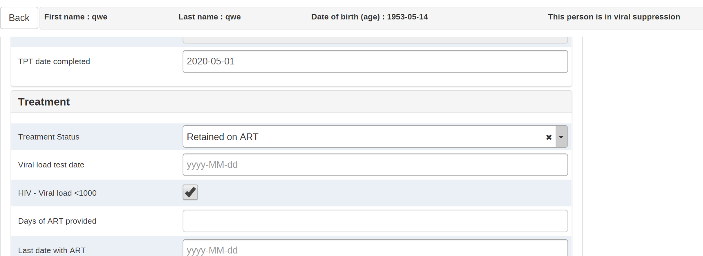

### Tablero de provisión de servicios

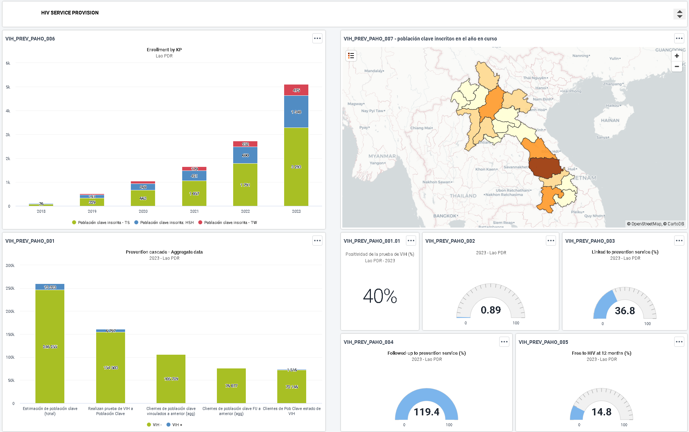

### Primer Pilar: Test realizado a poblaciones clave

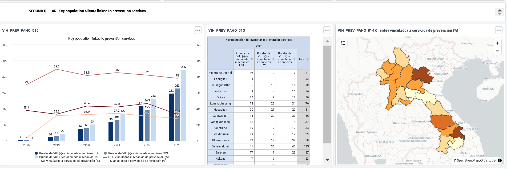

### Segundo Pilar: Poblaciones clave vinculadas a servicios de prevención

### Tercer Pilar: Población clave con seguimiento de servicio de prevención

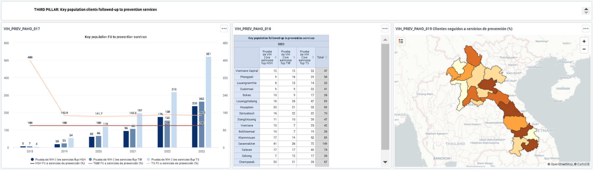

### Cuarto Pilar: Población clave que conoce su estado de VIH a los 12 meses

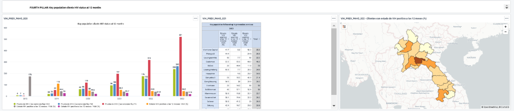

## Consideraciones de Implementación y Adaptación Local

Esta sección describe algunas consideraciones para adaptar la configuración al contexto y necesidades locales.

### Privacidad y Confidencialidad de Datos

La recolección de datos sobre poblaciones clave presenta ciertos desafíos, especialmente cuando la información se vincula o comparte entre proveedores de servicios y programas. Todos los datos de salud a nivel individual, incluidos los de las poblaciones clave, deben clasificarse como datos personales sensibles o información personal identificable, y requieren un alto estándar de seguridad y protección.

Todos los sistemas de información de salud deben tener protocolos robustos de seguridad de datos y confidencialidad para salvaguardar los datos, apoyados por leyes y políticas que protejan la información de salud.

Donde la seguridad y el potencial de acceso malicioso son muy altos, no se aconseja la recolección rutinaria de información sobre poblaciones clave. De manera similar, antes de capturar datos personalmente identificables como el nombre del cliente, fecha de nacimiento y otros datos indirectamente identificables, se debe realizar una evaluación de riesgos y revisión de seguridad de los sistemas electrónicos. Todos los usuarios deberan firmar un documento de confidencialidad de datos.

##Adaptación de la estructura del programa

La estructura del Rastreador de Prevención del VIH es mayormente plana, con solo una etapa principal repetible para registrar actividades para cualquier tipo de visita de prevención. Esta estructura intencionalmente simplificada permite una mayor flexibilidad para la adaptación y personalización local. Por ejemplo:

Las secciones pueden traducirse fácilmente en etapas en caso de que diferentes usuarios deban ingresar información diferente (como se detalló anteriormente, los servicios de Prevención del VIH son muy transversales y pueden tener varios actores involucrados en la distribución de los servicios).

Cantidad reducida de reglas de programa y bien identificadas por la sección objetivo.

Si una actividad específica no es relevante para el paquete de servicios de Prevención del VIH ofrecidos en su país, puede simplemente eliminar secciones enteras sin repercusiones en el resto del modelo de datos.

